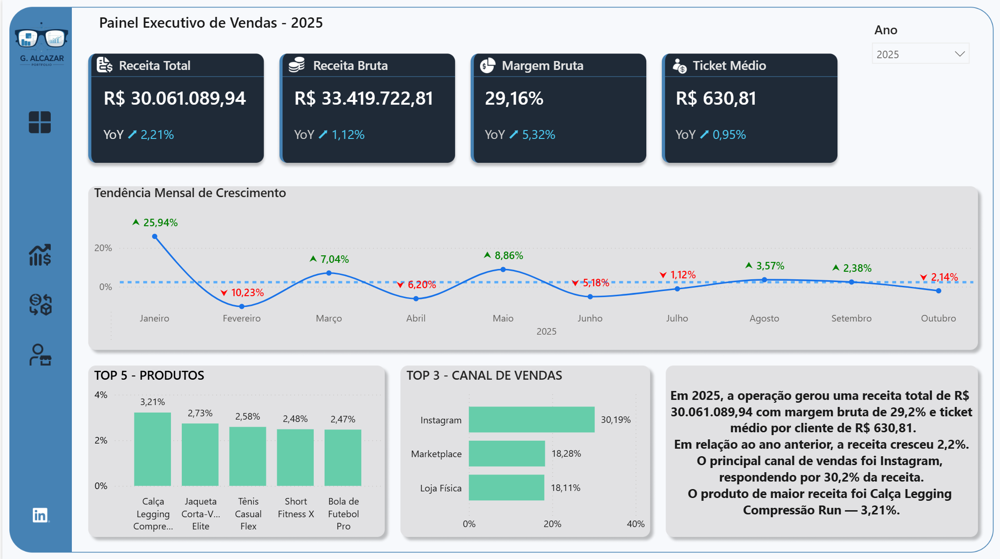
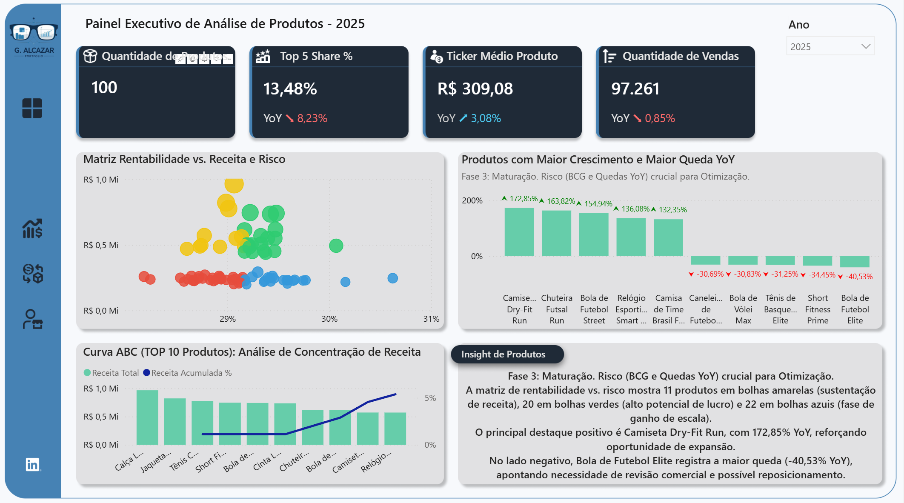
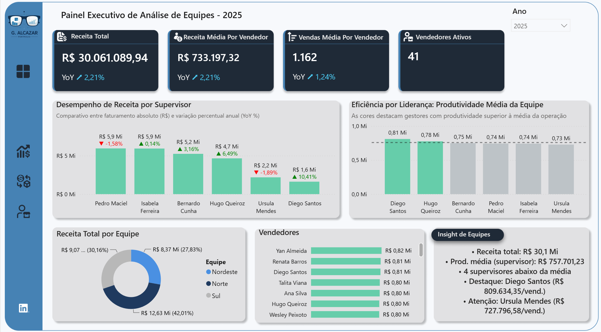

# 📊 Dashboard Executivo de Vendas

Dashboard executivo em Power BI para análise comercial de uma empresa fictícia de artigos esportivos, com dados conectados diretamente a um banco PostgreSQL.

> 🟡 Meu quarto projeto em Power BI, finalizado em 31/12/2025. Publicado em: https://app.powerbi.com/view?r=eyJrIjoiNDc4OWFmZTctMjFmNC00OTdkLTgyZTItMGI4MjFlZGUyMjBjIiwidCI6IjMxMGJmZTRmLWUyMTQtNDUzZC04ZTM1LWM5YmYzYzM4MWQyMSJ9

Este projeto representou um avanço em relação aos três primeiros trabalhos do portfólio: o desenvolvimento deixou de começar direto no Power BI e passou a incluir uma camada de dados própria (PostgreSQL), além de um volume bem maior de medidas DAX, análises estatísticas de portfólio de produtos (curva ABC, matriz de rentabilidade) e textos executivos gerados dinamicamente.

## 📌 Sobre o projeto

O dashboard analisa a operação comercial de uma empresa fictícia de artigos esportivos, cobrindo vendas, portfólio de produtos e desempenho da equipe comercial (vendedores e supervisores) entre 2023 e 2025. O relatório foi estruturado em três páginas temáticas — Vendas, Produtos e Vendedores — cada uma com KPIs, uma visão de tendência e um bloco de texto executivo gerado por DAX.

## 🎯 Objetivo

Com base nas medidas e visualizações confirmadas no modelo, o dashboard busca responder:

- Como a receita e a margem estão evoluindo mês a mês e ano a ano?
- Qual a participação de cada canal de vendas na receita total?
- Quais produtos mais contribuem para a receita (Top 5 / concentração de receita)?
- Quais produtos têm maior crescimento e maior queda no ano?
- Como os produtos se posicionam em uma matriz de margem × receita?
- Qual a concentração de receita no portfólio (curva ABC / Pareto)?
- Como vendedores e supervisores estão performando em relação às metas?
- Qual a produtividade média por vendedor e por equipe/supervisor?

## 🏗️ Arquitetura do projeto

O Power Query do modelo confirma que **todas as tabelas são carregadas via conexão direta a um banco PostgreSQL** (`PostgreSQL.Database("localhost", "postgres")`, schema `public`), a partir das tabelas `venda_itens`, `produtos`, `clientes`, `enderecos` e `vendedores` — não há arquivos CSV ou Excel na origem dos dados do relatório.

A etapa anterior ao Power BI (criação do banco, definição das tabelas e geração/inserção dos dados fictícios via Python) foi descrita pelo autor nas publicações que documentaram o desenvolvimento do projeto no LinkedIn. Essa camada não pôde ser verificada diretamente porque os scripts Python e SQL não fazem parte da pasta preservada deste projeto — apenas o arquivo `.pbix` e as imagens do dashboard foram mantidos. Conforme relatado pelo autor, o fluxo foi:

```
Python (geração/tratamento de dados fictícios)
        ↓
PostgreSQL (tabelas: produtos, clientes, enderecos, vendedores, venda_itens)
        ↓
Power BI (conexão direta ao banco via Power Query)
        ↓
DAX (medidas de negócio, YoY, ranking, textos dinâmicos)
        ↓
Dashboard executivo (Vendas / Produtos / Vendedores)
```

O autor também descreveu que o layout das páginas foi planejado previamente no Figma antes de ser reproduzido no Power BI — não há arquivo de design na pasta do projeto para confirmar isso de forma independente.

## 🗄️ Banco de dados

Confirmado via Power Query: banco PostgreSQL local (`postgres`), schema `public`, com 5 tabelas usadas pelo relatório — `venda_itens`, `produtos`, `clientes`, `enderecos` e `vendedores`. Não há evidência, nos arquivos preservados, de views, procedures ou índices — o Power BI lê as tabelas diretamente.

| Informação | Valor |
|---|---:|
| Período | 01/01/2023 a 31/10/2025 |
| Transações (linhas de venda) | 125.000 |
| Produtos | 100 |
| Vendedores | 41 |
| Supervisores | 7 |
| Equipes | 4 |
| Clientes | 100 |
| Canais de venda | 9 |

## 🧱 Modelo de dados

O modelo tem uma tabela fato (`fVenda_itens`, granularidade de item de venda, com 21 colunas incluindo receita bruta, receita líquida, custo, lucro bruto, margem, desconto, status, canal de venda, forma de pagamento e parcelas) relacionada a quatro dimensões (`dProdutos`, `dClientes`, `dVendedores`, `dCalendario`) por relacionamentos um-para-muitos com filtro em uma única direção. Há ainda `dEnderecos`, relacionada a `dClientes` por um relacionamento um-para-um bidirecional.

Essa estrutura — uma tabela fato central e dimensões conectadas a ela — é mais próxima de um modelo fato/dimensão consistente do que a modelagem dos projetos anteriores. As 118 medidas DAX ficam concentradas em uma tabela dedicada (`Medidas`), sem dados próprios — uma organização que não existia nos projetos anteriores do portfólio.

`dCalendario` tem colunas calculadas (Ano, NumMes, Mes, Trimestre, Nome Trimestre, DiaSemana, NomeDiaSem) e é usada como base para as funções de inteligência de tempo do modelo.

## 📐 Principais medidas DAX

O modelo tem 118 medidas — bem mais que os projetos anteriores — organizadas em pastas por tema (Receita, Custo, Lucro e Margem, Quantidade e Ticket, Participação e Segmentação, Produtos, Vendedores, Supervisores, Destaques, Auxiliares e Títulos). Algumas têm até descrição documentada, algo não visto nos projetos anteriores.

### Receita Total

```
Receita Total = CALCULATE(SUM(fVenda_itens[receitaliquida]), (fVenda_itens[status] = "APROVADA"))
```

Considera apenas transações com status aprovado, usando a receita líquida — uma regra de negócio explícita no modelo.

### Comparação YoY (ano a ano)

```
VAR Atual = TOTALYTD([Receita Total], dCalendario[Date])
VAR Antigo = CALCULATE(TOTALYTD([Receita Total], dCalendario[Date]), SAMEPERIODLASTYEAR(dCalendario[Date]))
RETURN COALESCE(DIVIDE(Atual - Antigo, Antigo), 0)
```

Usa `TOTALYTD` e `SAMEPERIODLASTYEAR` sobre `dCalendario`, comparando o acumulado do ano até a data com o mesmo período do ano anterior.

### Crescimento mensal híbrido

A medida `Crescimento Híbrido Valor` calcula a variação do mês corrente contra o mês anterior, mas trata meses incompletos: se o mês atual ainda não terminou, compara apenas os dias já decorridos do mês anterior (mesmo corte de dia); se o mês está completo, compara o mês anterior inteiro. Essa lógica é a que alimenta o gráfico "Tendência Mensal de Crescimento".

### Top 5 crescimento e queda (Produtos)

A medida `Top5 Crescimento_Queda YoY %` monta uma tabela com o YoY de todos os produtos (ignorando o filtro de contexto), seleciona os 5 maiores crescimentos e as 5 maiores quedas via `TOPN`, e retorna o valor apenas para os produtos selecionados — uma seleção Top N dinâmica, não uma lista fixa.

### Curva ABC / concentração de receita

```
Receita Acumulada % = DIVIDE([Receita Acumulada Produto], CALCULATE([Receita Total], ALL()))
```

A receita acumulada por produto (ordenada do maior para o menor) é dividida pelo total geral, gerando a curva de concentração usada no visual "Curva ABC (TOP 10 Produtos)". Não há evidência no modelo de uma coluna ou medida que classifique produtos explicitamente em classes A/B/C — a lógica de Pareto é aplicada via receita acumulada, mas as "classes" em si não são calculadas como categorias discretas.

### Classificação de produtos (matriz de rentabilidade)

O modelo tem duas medidas de classificação de produto com lógicas diferentes:

- `Classificação Produto Dinâmica` compara Margem Bruta % e Receita Total de cada produto com a média de todos os produtos, classificando em **Estrela** (margem e receita acima da média), **Vaca Leiteira** (receita acima da média, margem abaixo), **Aposta** (margem acima da média, receita abaixo) ou **Problema** (ambos abaixo da média). Os eixos dessa medida (margem % e receita R$) coincidem com os eixos do gráfico "Matriz Rentabilidade vs. Receita e Risco" da Página 2.
- `BCG Categoria Produto` usa uma lógica parecida, mas compara Crescimento YoY e % de Participação do produto (não margem/receita), com rótulos "Estrela", "Vaca Leiteira", "Ponto de Interrogação" e "Abacaxi". Essa segunda medida existe no modelo, mas não foi possível confirmar se está associada a algum visual do relatório atual.

### Textos executivos dinâmicos

As três páginas têm um bloco de texto gerado inteiramente por DAX, concatenando resultados de outras medidas com `FORMAT` e `UNICHAR(10)` para quebras de linha — por exemplo, `Resumo Executivo v5` (Página Vendas), `Insight_Produtos` (Página Produtos) e `Insight Executivo` (Página Vendedores). O sufixo "v5" no nome da primeira sugere que a medida passou por iterações antes da versão final. Um trecho de `Resumo Executivo v5`:

```
"Em " & AnoSel & ", a operação gerou uma receita total de " & FORMAT(ReceitaTotal, "R$ #,##0.00") &
" com margem bruta de " & FORMAT(Margem, "0.0%") & " e ticket médio por cliente de " & FORMAT(TicketMedio, "R$ #,##0.00") & "."
```

### Produtividade e metas (Vendedores/Supervisores)

`Produtividade (R$/Vendedor)` divide a receita total pelo número de vendedores ativos; `% Realização de Meta` compara a receita do vendedor com sua meta mensal (`Meta do Vendedor`); `Cor Status Meta` retorna uma cor hexadecimal (verde/amarelo/vermelho) conforme a faixa de realização, usada para formatação condicional; `Receita por Supervisor` usa `ALLEXCEPT` para agregar a receita de toda a equipe de um supervisor; `Ranking Vendedor` usa `RANKX` com desempate `Dense`.

A medida `Insight Executivo` (que gera o texto da Página Vendedores) exclui explicitamente a categoria "Diretoria Comercial" do cálculo da produtividade média dos supervisores — uma regra de negócio específica encontrada na fórmula.

## 🖥️ Dashboard

O relatório tem 3 páginas — **VENDAS**, **PRODUTOS** e **VENDEDORES** — sem página de capa dedicada. A navegação entre elas é feita por botões na barra lateral esquerda (ação `PageNavigation`, confirmada no arquivo do relatório), presentes nas três páginas. Não foram encontrados bookmarks no relatório. Cada página também tem um botão fixo com link direto para o LinkedIn do autor.

## 📊 Página 1 - Vendas

Título: **"Painel Executivo de Vendas - 2025"**



- **KPIs**: Receita Total (R$ 30.061.089,94), Receita Bruta (R$ 33.419.722,81), Margem Bruta (29,16%) e Ticket Médio (R$ 630,81), cada um com variação YoY.
- **Tendência Mensal de Crescimento**: gráfico de linha com a variação híbrida mês a mês (medida `Crescimento Híbrido Valor`), destacando meses de alta e de queda.
- **TOP 5 - Produtos**: participação percentual dos 5 produtos com maior receita.
- **TOP 3 - Canal de Vendas**: no modelo existem 9 canais distintos; o painel exibe os 3 principais (Instagram, Marketplace e Loja Física, no exemplo analisado).
- **Bloco de texto executivo**: gerado pela medida `Resumo Executivo v5`, resumindo receita, margem, ticket médio, variação YoY, canal principal e produto de maior receita em linguagem de negócio.
- **Filtro**: segmentação por Ano (único filtro visível na página).

## 📦 Página 2 - Produtos

Título: **"Painel Executivo de Análise de Produtos - 2025"**



- **KPIs**: Quantidade de Produtos (100), Top 5 Share % (13,48%), Ticket Médio Produto (R$ 309,08) e Quantidade de Vendas (97.261), com YoY.
- **Matriz Rentabilidade vs. Receita e Risco**: gráfico de dispersão com eixo X de Margem Bruta % e eixo Y de Receita Total por produto — confirmado como a medida `Classificação Produto Dinâmica`, que categoriza cada produto como Estrela, Vaca Leiteira, Aposta ou Problema a partir da comparação com a média do portfólio.
- **Produtos com Maior Crescimento e Maior Queda YoY**: os 5 produtos com maior alta e os 5 com maior queda no ano, selecionados dinamicamente pela medida `Top5 Crescimento_Queda YoY %`.
- **Curva ABC (TOP 10 Produtos)**: receita por produto (barras) combinada com receita acumulada percentual (linha), aplicando o princípio de Pareto para identificar concentração de receita — sem classificação explícita A/B/C no modelo, apenas a curva de acumulação.
- **Insight de Produtos**: bloco de texto dinâmico (`Insight_Produtos`) que muda de discurso conforme o ano selecionado (ex.: "Fase 1: Início da Operação" em 2023, "Fase 3: Maturação" em 2025) e resume contagem de produtos por classificação, maior crescimento e maior queda.

## 👥 Página 3 - Vendedores

Título: **"Painel Executivo de Análise de Equipes - 2025"**



- **KPIs**: Receita Total, Receita Média por Vendedor, Vendas Média por Vendedor e Vendedores Ativos (41), com YoY.
- **Desempenho de Receita por Supervisor**: receita absoluta por supervisor com variação YoY individual.
- **Eficiência por Liderança**: produtividade média da equipe de cada supervisor, com uma linha de referência (média da operação) destacando quem está acima ou abaixo do benchmark.
- **Receita Total por Equipe**: distribuição por equipe/região (Nordeste, Norte, Sul, no exemplo analisado).
- **Vendedores**: ranking de vendedores por receita.
- **Insight de Equipes**: texto dinâmico gerado pela medida `Insight Executivo`, com receita total, produtividade média por supervisor (excluindo a "Diretoria Comercial"), quantidade de supervisores abaixo da média, e destaques de melhor e pior produtividade.

## 🔎 Técnicas analíticas aplicadas

### Análise YoY

Comparações ano a ano usando `TOTALYTD` e `SAMEPERIODLASTYEAR` sobre a tabela `dCalendario`, aplicadas a receita, margem, ticket médio e quantidade.

### Ranking e Top N dinâmico

Seleção automática de Top 5/Top 10 produtos e vendedores via `TOPN`, sem listas fixas — usada tanto nos rankings quanto na medida de crescimento/queda de produtos.

### Matriz de rentabilidade (margem × receita)

Classificação de produtos em quatro quadrantes a partir da comparação com a média do portfólio, usada como apoio à decisão de investimento, manutenção ou revisão de produtos.

### Curva ABC / Pareto

Receita acumulada por produto para identificar concentração de faturamento nos principais itens do portfólio.

### Benchmark de produtividade

Comparação da produtividade de cada supervisor com a média da operação, usada tanto no gráfico quanto no insight textual da página de Vendedores.

### Textos executivos dinâmicos (storytelling)

Medidas DAX que geram parágrafos completos combinando texto fixo com valores calculados, adaptando o discurso ao contexto de filtro (ano selecionado, canal líder, produto líder etc.).

## 🎨 Design orientado ao usuário

Segundo a documentação do desenvolvimento feita pelo autor, o ponto de partida do projeto não foi a escolha dos gráficos, mas a pergunta "quem é o usuário deste relatório?". A resposta — um perfil executivo, com pouco tempo para explorar filtros e necessidade de leitura rápida — orientou decisões observáveis no relatório: cada página tem apenas um filtro principal (Ano), os KPIs ficam concentrados no topo, e cada página termina com um bloco de texto interpretativo (não apenas números) resumindo o cenário e apontando pontos de atenção.

## 🧰 Tecnologias utilizadas

- **Power BI Desktop** — modelagem de dados e construção do relatório.
- **PostgreSQL** — banco de dados de origem, acessado via conector nativo `PostgreSQL.Database`.
- **Power Query (linguagem M)** — leitura das tabelas do banco.
- **DAX** — 118 medidas, incluindo inteligência de tempo, ranking dinâmico, classificação de produtos e textos executivos gerados dinamicamente.
- **Python** — citado pelo autor como responsável pela geração/inserção dos dados fictícios no PostgreSQL; os scripts não fazem parte da pasta preservada deste projeto.
- **Figma** — citado pelo autor como ferramenta usada para planejar o layout antes da construção no Power BI; não há arquivos de design na pasta do projeto.

## 🧠 Aprendizados

Em relação aos três primeiros projetos do portfólio, este trabalho representou uma mudança de maturidade:

- Pensar a solução de BI a partir da camada de dados (banco de dados próprio), e não apenas a partir do Power BI.
- Definir o público-alvo do relatório antes de desenhar os visuais, e usar essa definição para limitar filtros e priorizar KPIs.
- Aplicar técnicas analíticas de negócio além de agregações simples: Pareto/curva ABC, matriz de rentabilidade em quadrantes, ranking Top N dinâmico e benchmark de produtividade.
- Construir textos executivos totalmente dinâmicos via DAX, adaptando a narrativa ao contexto de filtro em vez de usar textos fixos.
- Organizar as medidas em uma tabela dedicada, com pastas de exibição e descrições — uma prática de organização não usada nos projetos anteriores.
- Tratar explicitamente regras de negócio na modelagem (ex.: considerar apenas vendas aprovadas na receita, excluir uma categoria específica de um cálculo médio).

## 📈 Evolução do projeto

Este projeto representou um dos maiores avanços da minha trajetória até aquele momento. O foco deixou de estar apenas na construção de visuais e passou a envolver a camada de dados, regras de negócio, definição de público-alvo e construção de análises orientadas à decisão — building blocks que não estavam presentes da mesma forma nos três primeiros projetos do portfólio.

## 🚀 Possíveis evoluções futuras

- Automatizar a ingestão de dados no PostgreSQL (hoje descrita como um processo manual/script, sem pipeline agendado ou API).
- Revisar a existência de duas medidas de classificação de produto com lógicas e rótulos diferentes (`Classificação Produto Dinâmica` e `BCG Categoria Produto`), consolidando em uma única abordagem.
- Nomear de forma mais clara medidas auxiliares cujo conteúdo não corresponde ao nome (ex.: `YoY Receita Total`, que retorna um código de cor hexadecimal, não o percentual de variação).
- Formalizar classes A/B/C explícitas na curva ABC, hoje representada apenas pela receita acumulada percentual.
- Complementar o texto de insight de produtos para citar também a contagem de produtos na categoria de risco (hoje o texto cita apenas as categorias de sustentação, potencial e escala).
- Publicar os scripts de geração de dados (Python/SQL) junto ao repositório, para tornar o pipeline completo reprodutível a partir do GitHub.
- Avaliar Row-Level Security (RLS) caso o relatório venha a ser usado por diferentes supervisores/equipes.
- Adicionar drill-through entre as páginas (ex.: de um supervisor para o detalhe de seus vendedores).
- Revisar tooltips customizados, não identificados no modelo atual.
- Documentar formalmente as regras de negócio embutidas nas medidas (status aprovado, exclusão de categorias específicas etc.).

## 📣 Repercussão do projeto

Durante o desenvolvimento, diferentes etapas do projeto foram compartilhadas no LinkedIn pelo autor, gerando comentários e trocas com outros profissionais da área de dados sobre as técnicas aplicadas (pipeline de dados, matriz de rentabilidade, curva ABC e análise de equipes).

## 📁 Estrutura do projeto

```
dashboard-vendas-esportivas/
├── README.md
├── DashboardVendasEsportivo.pbix
└── imagem/
    ├── Pagina1.png    # Vendas - visão executiva
    ├── Pagina2.png    # Produtos - matriz de rentabilidade e curva ABC
    └── Pagina3.png    # Vendedores - desempenho de equipes
```

Os scripts de banco de dados (PostgreSQL) e de geração de dados (Python) mencionados no desenvolvimento do projeto não fazem parte desta pasta.

## 👤 Autor

**Gabriel Alcazar**

- LinkedIn: [linkedin.com/in/gabriel-alcazar-3329a91b4](https://www.linkedin.com/in/gabriel-alcazar-3329a91b4/)
- GitHub: [github.com/AlcazarGabriel](https://github.com/AlcazarGabriel)
