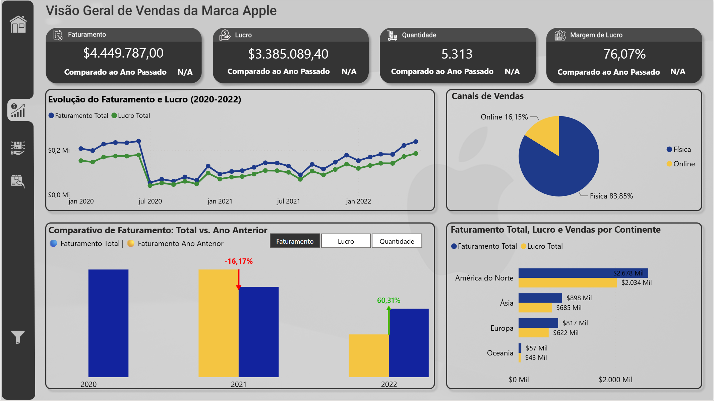
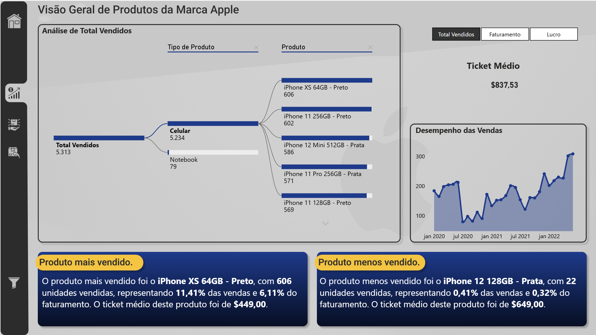
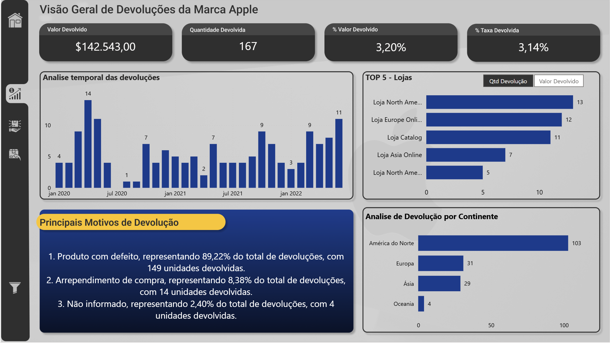

# 🍎 Dashboard Comercial - Vendas Apple

Dashboard comercial em Power BI que analisa vendas, desempenho de produtos e devoluções de uma linha de produtos da marca Apple.

> 🟡 Meu terceiro projeto em Power BI, publicado em 24/03/2025. Desenvolvido após os projetos "Evolução dos Preços de Combustíveis no Brasil" e "Carga Tributária Brasileira", marcou uma nova etapa da minha trajetória: conexão direta a um banco de dados, modelo com tabelas fato e dimensão, field parameters, árvore de decomposição e textos dinâmicos.

## 📌 Sobre o projeto

O projeto simula um dashboard comercial de análise de vendas, organizado em três frentes: **Vendas**, **Produtos** e **Devoluções**, cobrindo o período de janeiro de 2020 a junho de 2022. O relatório parte de uma capa de navegação e permite explorar faturamento, lucro, desempenho de produtos e comportamento de devoluções por loja, país e continente.

Diferente dos dois primeiros projetos do portfólio (que partiam de arquivos CSV estáticos), este dashboard se conecta a um banco de dados MySQL local, o que já representa uma evolução na forma de obter e tratar os dados.

## 🎯 Objetivo da análise

Com base nas visualizações e medidas encontradas no modelo, as perguntas que o dashboard busca responder são:

- Como faturamento, lucro e quantidade vendida evoluíram entre 2020 e 2022?
- Qual foi o desempenho de cada ano em relação ao ano anterior?
- Qual canal concentra mais vendas: loja física ou online?
- Quais continentes apresentam maior faturamento e lucro?
- Quais produtos têm melhor e pior desempenho de vendas?
- Qual o ticket médio das vendas?
- Qual a taxa e o valor de devoluções no período?
- Quais lojas concentram mais devoluções?
- Quais são os principais motivos de devolução?

## 🗂️ Fonte dos dados

Diferente dos dois projetos anteriores, este modelo **não usa arquivos CSV** — todas as tabelas de fato e dimensão são carregadas via **conexão direta a um banco de dados MySQL** (`MySQL.Database`), no servidor local `127.0.0.1`, banco `bdteste`, a partir de views específicas:

- `vw_vendas_apple` → tabela `fVendasApple`
- `vw_produtos_apple` → tabela `dProdutosApple`
- `vw_devolucoes_apple` → tabela `fDevolucoesApple`
- `vw_lojas_completas` → tabela `dLojas`
- `vw_localidades` → tabela `dLocalidades`

O nome do banco (`bdteste`) e a ausência de qualquer referência a uma fonte pública ou institucional no Power Query indicam que se trata de uma **base de dados de estudo/teste**, provavelmente povoada especificamente para a prática deste projeto — não há evidência nos arquivos de que os dados venham de um dataset público oficial. Os produtos usam nomes e categorias da marca Apple (iPhone, MacBook etc.), mas **não há qualquer indicação de que os valores de venda, lucro ou devolução representem resultados financeiros reais da Apple Inc.** Trate-os como dados fictícios/de estudo, usados para simular um cenário comercial de varejo.

## 🧱 Modelo de dados

O modelo tem 6 tabelas de dados, todas relacionadas por chaves em relacionamentos um-para-muitos, filtro em uma única direção:

| Informação | Valor |
|---|---|
| Período | 01/01/2020 a 30/06/2022 |
| Registros de venda | 5.313 |
| Registros de devolução | 166 |
| Produtos distintos | 61 |
| Tipos de produto | 4 (Celular, Notebook, Relógio, Acessórios) |
| Lojas | 306 |
| Países | 34 |
| Continentes | 4 (América do Norte, Europa, Ásia, Oceania) |
| Canais de venda | 2 (Física, Online — coluna `tipo` de `dLojas`) |

**Tabelas fato**: `fVendasApple` (vendas) e `fDevolucoesApple` (devoluções).
**Tabelas dimensão**: `dProdutosApple`, `dLojas`, `dLocalidades` e `dCalendario` (com colunas calculadas: Ano, Num Mês, Mês, Início Mês, Trimestre, Nome Trimestre, Data Vigente).

`fVendasApple` se relaciona com `dProdutosApple` (por `sku`), `dLojas` (por `id_loja`) e `dCalendario` (por `data_venda`); `fDevolucoesApple` segue o mesmo padrão; `dLojas` se relaciona com `dLocalidades` (por `id_localidade`). Essa estrutura — duas tabelas fato e dimensões compartilhadas entre elas — é mais próxima de um modelo fato/dimensão organizado do que a modelagem dos dois projetos anteriores do portfólio.

O modelo também tem 4 tabelas auxiliares dedicadas a parâmetros e textos: `Medida` (hospeda a maior parte das medidas), `Tabela_Parametros`, `Parâmetro` e `ParâmetroDev`. As duas últimas têm a estrutura padrão de **field parameters** do Power BI (colunas de campo e de ordem ocultas), usadas para alternar dinamicamente entre métricas nos gráficos.

## 📐 Indicadores e medidas

O modelo tem 111 medidas DAX organizadas em pastas de exibição (Vendas, Devolução, TOP, Setas, Tooltip) — um volume bem maior que os projetos anteriores.

### Faturamento e Lucro

```
Faturamento Total = SUMX(fVendasApple, fVendasApple[qtd_vendida] * RELATED(dProdutosApple[preco_unitario]))

Lucro Total = SUMX(fVendasApple, fVendasApple[qtd_vendida] * (RELATED(dProdutosApple[preco_unitario]) - RELATED(dProdutosApple[custo_unitario])))
```

Faturamento e lucro são calculados linha a linha, cruzando a quantidade vendida com o preço e o custo unitário do produto relacionado — o que já demonstra o uso da dimensão de produtos (incluindo custo) para chegar à margem.

### Margem de Lucro e Ticket Médio

`Margem de Lucro (%)` divide o Lucro Total pelo Faturamento Total; `Ticket Medio` divide o Faturamento Total pela quantidade de vendas.

### Comparação com o ano anterior

```
Faturamento Ano Anterior = CALCULATE([Faturamento Total], DATEADD(dCalendario[Data], -1, YEAR))

% Crescimento YoY =
VAR crescimento = DIVIDE([Faturamento Total] - [Faturamento Ano Anterior], [Faturamento Ano Anterior])
RETURN IF(HASONEVALUE(dCalendario[Ano]) && crescimento <> BLANK(), crescimento, "N/A")
```

Essa medida explica um comportamento visível nas imagens do projeto: os cards "Comparado ao Ano Passado" mostram **N/A** quando mais de um ano está no contexto de filtro (por exemplo, com o período completo selecionado) — não se trata de um erro, e sim de uma regra explícita na medida (`HASONEVALUE`).

### Taxa e valor de devolução

```
TaxaDevolucao = COALESCE(DIVIDE(SUM(fDevolucoesApple[qtd_devolvida]), SUM(fVendasApple[qtd_vendida]), 0), 0)

Valor Devolvido = COALESCE(SUMX(fDevolucoesApple, fDevolucoesApple[qtd_devolvida] * RELATED(dProdutosApple[preco_unitario])), 0)
```

Há também medidas específicas por motivo de devolução (`DevolucoesPorPD`, `DevolucoesPorArrependimento`, `DevolucoesPorNI`), que somam a quantidade devolvida filtrando cada valor de `motivo_devolucao`.

### Ranking de produtos (TOP)

```
Top Produto = CALCULATE(MAX(dProdutosApple[produto]), TOPN(1, ALL(dProdutosApple[produto]), [Qtd Venda]))
```

Junto com `Menor Produto` e as medidas de participação (`% Vendas TOP 1`, `% Faturamento Top 1 Produto`), essas medidas alimentam os blocos de texto "Produto mais vendido" e "Produto menos vendido" da página de Produtos.

### Textos dinâmicos

Medidas como `Informacao_Produto` e `Texto Tooltip` retornam texto (não número), combinando `SELECTEDVALUE`, `CALCULATE`/`TOPN` e `FORMAT` para montar frases prontas — por exemplo, `Texto Tooltip` monta a frase "Destaque do Mês: Produto Mais Vendido! [produto] com [quantidade] unidades vendidas, representando [%] do faturamento e [%] do lucro total no mês." Os blocos de texto das páginas de Produtos e Devoluções usam essa mesma lógica, combinando caixas de texto com medidas DAX inseridas diretamente no texto.

## 🧭 Navegação do relatório

A navegação foi confirmada diretamente no arquivo do relatório (`Report/Layout`):

- **Capa → Vendas / Produtos / Devolução**: os três botões da capa usam ação do tipo `PageNavigation`, cada um apontando para a página correspondente. Um quarto botão na capa é um link externo (`WebUrl`) para o LinkedIn do autor.
- **Menu lateral**: as páginas Vendas, Produtos e Devolução têm botões de navegação entre si e de volta à Capa, também via `PageNavigation`.
- **Painel de filtros retrátil**: cada página tem um botão com ação `Bookmark`, alternando entre os bookmarks "Painel Exibido" / "Painel Oculto" (e variações "2" e "Prod") para mostrar ou esconder o painel de segmentações.
- **Botão "Limpar Filtro"**: usa a ação nativa `ClearAllSlicers`.
- **Alternância de métricas**: os botões "Faturamento", "Lucro" e "Quantidade" (página Vendas) e "Total Vendidos", "Faturamento" e "Lucro" (página Produtos) funcionam através das tabelas de field parameter (`Tabela_Parametros`, `Parâmetro`), que trocam a medida exibida via `SWITCH(TRUE(), SELECTEDVALUE(...), ...)`.
- **Tooltips personalizados**: o arquivo contém páginas ocultas dedicadas (`TooltipDev`, `TooltipDevCont`, `TooltipVendasQTD`, `TooltipQtdVendas`), configuradas como tooltip de relatório para os gráficos principais.

## 🏠 Capa

🔗 [Acesse o dashboard publicado no Power BI](https://app.powerbi.com/view?r=eyJrIjoiZDc0YzVhMTMtYmJjZC00YWU5LTg1ZDQtNmY3NTI3ZTU4OTIyIiwidCI6IjMxMGJmZTRmLWUyMTQtNDUzZC04ZTM1LWM5YmYzYzM4MWQyMSJ9) — publicado em 24/03/2025


A capa apresenta o título "Análise Dashboard Comercial" e três opções de navegação — Vendas, Produtos e Devolução — funcionando como ponto de entrada do relatório.

## 📊 Página 1 - Vendas

Título: **"Visão Geral de Vendas da Marca Apple"**



- **KPIs**: Faturamento ($4.449.787,00), Lucro ($3.385.089,40), Quantidade (5.313) e Margem de Lucro (76,07%), cada um com comparação ao ano anterior (exibindo N/A quando mais de um ano está selecionado, como explicado acima).
- **Evolução do Faturamento e Lucro (2020-2022)**: gráfico de linhas mensal comparando as duas métricas.
- **Canais de Vendas**: gráfico de pizza mostrando a distribuição entre lojas Física (83,85%) e Online (16,15%).
- **Comparativo de Faturamento: Total vs. Ano Anterior**: gráfico de colunas por ano, com alternância entre Faturamento, Lucro e Quantidade via field parameter.
- **Faturamento Total, Lucro e Vendas por Continente**: comparação entre América do Norte, Ásia, Europa e Oceania.
- **Filtros**: seis segmentações (não totalmente identificadas nas imagens, mas confirmadas no relatório) além do painel retrátil e do botão de limpar filtros.

## 📦 Página 2 - Produtos

Título: **"Visão Geral de Produtos da Marca Apple"**



- **Árvore de Decomposição** ("Análise de Total Vendidos"): confirmada no relatório como um visual `decompositionTreeVisual` nativo do Power BI, permitindo detalhar Total Vendidos (5.313) por Tipo de Produto (ex.: Celular 5.234, Notebook 79) e depois por Produto individual (ex.: iPhone XS 64GB - Preto, 606 unidades).
- **Botões Total Vendidos / Faturamento / Lucro**: alternam a métrica analisada, também via field parameter.
- **Ticket Médio**: $837,53 no período analisado.
- **Desempenho das Vendas**: gráfico de área com a evolução mensal das vendas.
- **Produto mais vendido / menos vendido**: dois blocos de texto dinâmico. Nas imagens, o produto mais vendido é o iPhone XS 64GB - Preto (606 un., 11,41% das vendas, 6,11% do faturamento, ticket médio $449,00) e o menos vendido é o iPhone 12 128GB - Prata (22 un., 0,41% das vendas, 0,32% do faturamento, ticket médio $649,00).
- O relatório também usa um visual de narrativa inteligente (Smart Narrative, identificado no arquivo como `enlightenDataStory...`) nesta página.

## ↩️ Página 3 - Devoluções

Título: **"Visão Geral de Devoluções da Marca Apple"**



- **KPIs**: Valor Devolvido ($142.543,00), Quantidade Devolvida (167 unidades), % Valor Devolvido (3,20%) e % Taxa Devolvida (3,14%).
- **Análise temporal das devoluções**: gráfico de colunas mensal com a quantidade de devoluções.
- **TOP 5 - Lojas**: ranking de lojas por devolução, com alternância entre Qtd Devolução e Valor Devolvido (via o field parameter `ParâmetroDev`).
- **Análise de Devolução por Continente**: América do Norte concentra a maior parte das devoluções (103), seguida por Europa (31), Ásia (29) e Oceania (4).
- **Principais Motivos de Devolução**: bloco de texto dinâmico listando Produto com defeito (89,22%, 149 unidades), Arrependimento de compra (8,38%, 14 unidades) e Não informado (2,40%, 4 unidades) — valores calculados pelas medidas `DevolucoesPorPD`, `DevolucoesPorArrependimento` e `DevolucoesPorNI`.

## 🔎 Principais análises

### Evolução de faturamento e lucro

O faturamento apresenta uma queda visível em meados de 2020 e uma recuperação gradual até 2022, com o lucro acompanhando de perto a mesma tendência — a margem de lucro do período é de 76,07%.

### Comparação com ano anterior

O comparativo anual mostra queda de 16,17% de 2020 para 2021 e alta de 60,31% de 2021 para 2022 (considerando que a base de 2022 cobre apenas o primeiro semestre).

### Canais de venda

A loja física concentra a grande maioria das vendas (83,85%), com o canal online representando uma fatia bem menor (16,15%).

### Desempenho por continente

América do Norte é o continente com maior faturamento e lucro, seguido por Ásia e Europa; Oceania tem participação bem menor.

### Performance dos produtos

A árvore de decomposição permite ver que a categoria Celular domina o volume de vendas (5.234 de 5.313 unidades), com o iPhone XS 64GB - Preto como produto mais vendido.

### Análise de devoluções

A taxa de devolução geral é baixa (3,14%), mas fortemente concentrada em um único motivo: produto com defeito responde por quase 90% das devoluções registradas.

## 🧰 Tecnologias utilizadas

- **Power BI Desktop** — modelagem de dados e construção do relatório.
- **MySQL** — banco de dados de origem, acessado via conector nativo `MySQL.Database` no Power Query.
- **Power Query (linguagem M)** — importação das views do banco e mesclagens (ex.: junção de imagens de produto por SKU e por tipo de produto).
- **DAX** — 111 medidas, incluindo inteligência de tempo, rankings (`TOPN`), textos dinâmicos e field parameters.
- **Field parameters** — usados para alternância de métricas em vários visuais.
- **Bookmarks** — usados para mostrar/ocultar o painel de filtros.
- **Árvore de Decomposição e Narrativa Inteligente (Smart Narrative)** — visuais nativos do Power BI usados na página de Produtos.
- **Tooltips de relatório personalizados** — páginas ocultas dedicadas a tooltips.

## 🧠 Aprendizados

Em relação aos dois primeiros projetos do portfólio, este trabalho me permitiu evoluir em:

- Conexão direta a um banco de dados relacional (MySQL) em vez de arquivos CSV estáticos.
- Modelagem com tabelas fato e dimensão relacionadas de forma consistente (relacionamentos um-para-muitos em uma única direção).
- Uso de field parameters nativos do Power BI para alternância dinâmica de métricas.
- Construção de textos e títulos dinâmicos combinando DAX com caixas de texto.
- Uso de visuais mais avançados, como Árvore de Decomposição e Narrativa Inteligente.
- Configuração de tooltips de relatório personalizados em páginas dedicadas.
- Organização de um relatório multi-página com navegação estruturada (capa + três áreas temáticas) e painel de filtros retrátil via bookmarks.
- Criação de um volume bem maior de medidas DAX, incluindo rankings, comparações temporais e indicadores de tendência.

## 📈 Evolução do projeto

Este foi meu terceiro projeto desenvolvido em Power BI e marcou uma mudança para uma abordagem mais próxima de um dashboard comercial. O relatório passou a organizar diferentes perspectivas do negócio em páginas específicas, separando vendas, produtos e devoluções, e ampliou o uso de indicadores, navegação e recursos analíticos em relação aos dois primeiros projetos do portfólio.

## 🚀 Possíveis evoluções futuras

- Padronizar a técnica de alternância de métricas: hoje o projeto mistura um field parameter nativo (`Parâmetro`, `ParâmetroDev`) com uma tabela desconectada tratada manualmente via `SWITCH` (`Tabela_Parametros`) para o mesmo tipo de necessidade.
- Revisar e remover páginas aparentemente não utilizadas encontradas no arquivo (uma página genérica "Página 2" com poucos visuais e uma página "TooltipFat" sem nenhum visual).
- Melhorar a mensagem exibida quando a comparação com o ano anterior não é aplicável, hoje exibida apenas como "N/A" sem explicação contextual.
- Investigar a duplicidade de nomes truncados no ranking "TOP 5 - Lojas" (duas lojas aparentam começar com "Loja North Ame...").
- Avaliar a redução do número de medidas dedicadas a ícones de tendência (pasta "Setas", com cerca de 15 medidas), possivelmente substituíveis por formatação condicional nativa.
- Documentar formalmente a origem dos dados (mesmo sendo uma base de estudo) e considerar publicar uma amostra dos dados (ex.: CSV) junto ao repositório, já que a conexão MySQL local não é reproduzível a partir do GitHub.
- Revisar a identidade visual e a hierarquia de informação das páginas, reduzindo elementos decorativos onde possível.
- Adicionar drill-through dedicado (não identificado no modelo atual) para aprofundar a análise por produto ou por loja.
- Atualizar a base para incluir dados mais recentes (o período atual vai até junho de 2022).

## 📁 Estrutura do projeto

```
vendas-apple/
├── README.md
├── ProjetoVendasApple.pbix
└── imagem/
    ├── Capa.png       # Capa - navegação inicial
    ├── Pagina1.png    # Vendas - visão geral
    ├── Pagina2.png    # Produtos - árvore de decomposição e ranking
    └── Pagina3.png    # Devoluções - visão geral
```

Os dados de origem residem em um banco MySQL local e não fazem parte deste repositório.

## 👤 Autor

**Gabriel Alcazar**

- LinkedIn: [linkedin.com/in/gabriel-alcazar-3329a91b4](https://www.linkedin.com/in/gabriel-alcazar-3329a91b4/)
- GitHub: [github.com/AlcazarGabriel](https://github.com/AlcazarGabriel)
