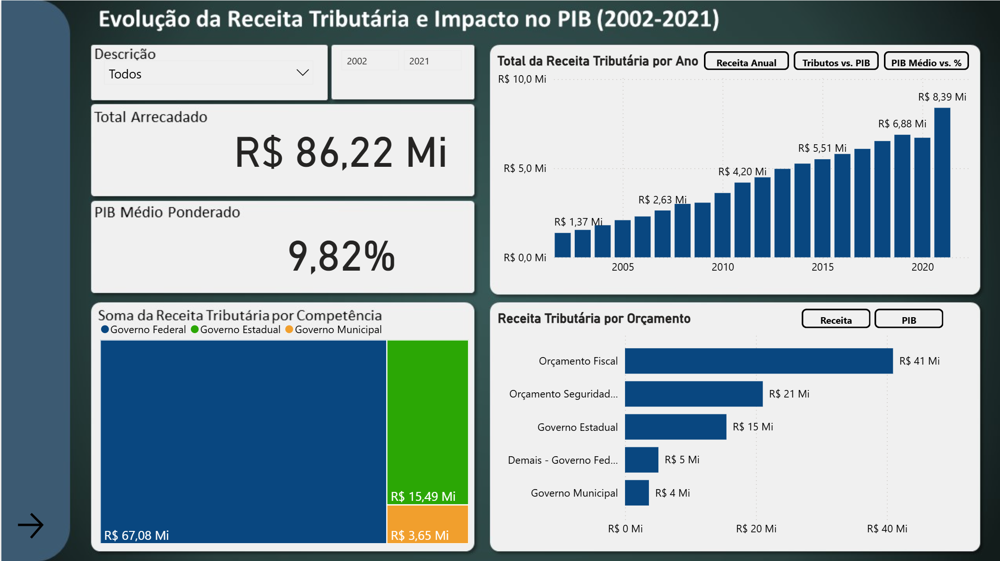
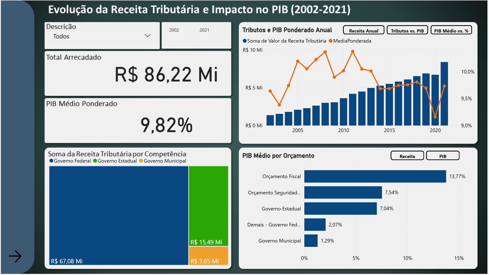
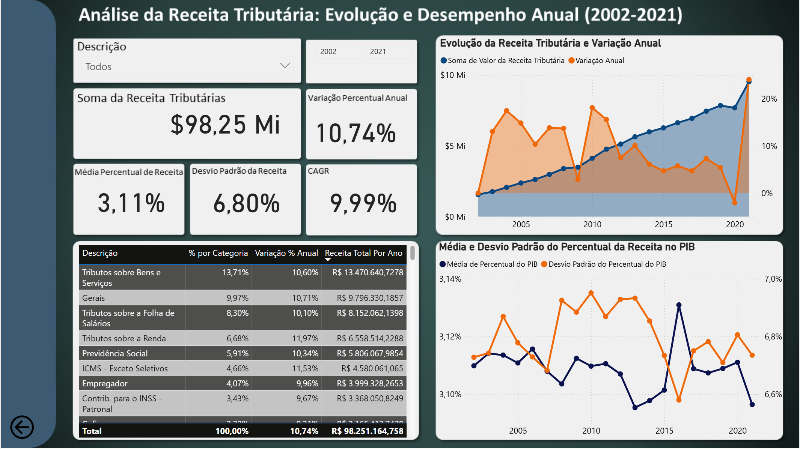

# 📊 Carga Tributária Brasileira

Dashboard em Power BI que analisa a evolução da receita tributária brasileira e sua relação com o PIB entre 2002 e 2021.

> 🟡 **Meu segundo projeto em Power BI**, desenvolvido após o dashboard de preços de combustíveis. Publicado em 11/09/2024, representa a etapa seguinte da minha trajetória com Business Intelligence: aqui passei a explorar medidas DAX próprias, indicadores estatísticos e uma segunda página de análise.

## 📌 Sobre o projeto

O projeto analisa a evolução da receita tributária no Brasil entre 2002 e 2021, relacionando-a ao Produto Interno Bruto (PIB) do período. O modelo organiza os dados em duas tabelas com níveis de detalhe diferentes: uma com a receita segmentada por competência (Governo Federal, Estadual e Municipal) e tipo de orçamento, e outra com a receita detalhada por categoria/tributo (104 categorias distintas).

Em relação ao primeiro projeto do portfólio, este dashboard já inclui medidas DAX autorais, uma segunda página de relatório e navegação entre páginas via botões.

## 🎯 Objetivo da análise

Com base nos dados e nas visualizações do relatório, as perguntas que o dashboard busca responder são:

- Como a receita tributária evoluiu entre 2002 e 2021?
- Qual foi a relação entre a receita tributária e o PIB no período?
- Como a arrecadação se distribui entre Governo Federal, Estadual e Municipal?
- Como a receita se distribui entre os diferentes orçamentos (Fiscal, Seguridade Social etc.)?
- Qual foi a variação percentual da receita ano a ano?
- Qual foi o crescimento composto (CAGR) da receita no período?
- Qual a dispersão (desvio padrão) da receita e do percentual do PIB ao longo dos anos?
- Quais categorias tributárias têm maior participação na receita total?

## 🗂️ Fonte dos dados

A origem exata dos dados (instituição responsável, portal ou URL oficial) não pôde ser identificada nos arquivos do projeto. No Power Query, os dados são carregados a partir de dois arquivos CSV locais (`Tabela 1 - Base de Incidência.csv` e `Tabela 2 - Tributo e Competência.csv`), sem referência de origem preservada na consulta.

A estrutura dos campos (Ano-calendário, Código da Receita Tributária, Competência, Orçamento, Percentual do PIB) é compatível com estatísticas de carga tributária normalmente publicadas por órgãos como a Receita Federal ou o Tesouro Nacional, mas essa associação não pôde ser confirmada nos arquivos preservados.

## 🧱 Estrutura dos dados

O modelo possui 2 tabelas de dados e 1 tabela auxiliar:

**Tabela 1 - Base de Incidência** — 2.100 linhas, período de 2002 a 2021, com 104 categorias distintas no campo Descrição. Colunas: Ano-calendário, Código da Receita Tributária, Descrição, Valor da Receita Tributária, Percentual do PIB, e uma coluna calculada `Data` (usada para habilitar inteligência de tempo).

**Tabela 2 - Tributo e Competência** — 900 linhas, período de 2002 a 2021. Colunas: Ano-calendário, Competência (Governo Federal / Governo Estadual / Governo Municipal), Orçamento (Orçamento Fiscal, Orçamento Seguridade Social, Demais - Governo Federal, Governo Estadual, Governo Municipal), Descrição, Valor da Receita Tributária, Percentual do PIB.

**TabelaGrafico2** — tabela auxiliar com uma única coluna (`Tipo de Gráfico`, valores "Grafico 1/2/3"), criada diretamente no Power Query com dados fixos. Não foi identificado nenhum visual do relatório atual que utilize essa tabela.

As duas tabelas principais são relacionadas por um relacionamento muitos-para-muitos bidirecional em `Ano-calendário` (ativo), além de um segundo relacionamento em `Descrição` (inativo). Não existe uma tabela calendário dedicada — a inteligência de tempo usa a tabela de datas automática do Power BI.

## 📐 Indicadores e cálculos

O modelo tem 20 medidas DAX (18 na Tabela 1, 2 na Tabela 2) — uma evolução em relação ao primeiro projeto do portfólio, que não utilizava nenhuma medida customizada.

### Receita Total / Peso

Somam o valor da receita tributária. Existem três medidas equivalentes para esse cálculo (`Receita Total`, `Receita Total Por Ano`, `SomaReceita`), além de `Peso`, sua versão na Tabela 2.

```
Peso = sum('Tabela 2 - Tributo e Competência'[Valor da Receita Tributária])
```

### PIB Médio Ponderado

Calcula a média do percentual do PIB ponderada pelo valor da receita de cada linha:

```
MediaPonderada =
SUMX(
    'Tabela 2 - Tributo e Competência',
    'Tabela 2 - Tributo e Competência'[Percentual do PIB]
    * 'Tabela 2 - Tributo e Competência'[Valor da Receita Tributária]
    / SUM('Tabela 2 - Tributo e Competência'[Valor da Receita Tributária])
)
```

### Variação Percentual Anual

Compara a receita do ano corrente com a do ano anterior, usando `DATEADD` sobre a coluna calculada `Data`. Existem quatro variações dessa mesma ideia no modelo (`Crescimento Anual`, `Variação Percentual Anual`, `Crescimento AnualNovo` e `Variação Anual`), construídas com `DATEADD` ou `PREVIOUSYEAR`.

```
Receita Ano Anterior =
CALCULATE(
    SUM('Tabela 1 - Base de Incidência'[Valor da Receita Tributária]),
    DATEADD('Tabela 1 - Base de Incidência'[Data], -1, YEAR)
)
```

### CAGR

Calcula a taxa composta de crescimento anual entre o primeiro e o último ano disponíveis no contexto de filtro:

```
CAGR =
VAR AnoInicial = MINX(ALL('Tabela 1 - Base de Incidência'), 'Tabela 1 - Base de Incidência'[Ano-calendário])
VAR AnoFinal = MAXX(ALL('Tabela 1 - Base de Incidência'), 'Tabela 1 - Base de Incidência'[Ano-calendário])
VAR ValorInicial = CALCULATE(SUM('Tabela 1 - Base de Incidência'[Valor da Receita Tributária]), 'Tabela 1 - Base de Incidência'[Ano-calendário] = AnoInicial)
VAR ValorFinal = CALCULATE(SUM('Tabela 1 - Base de Incidência'[Valor da Receita Tributária]), 'Tabela 1 - Base de Incidência'[Ano-calendário] = AnoFinal)
VAR Anos = AnoFinal - AnoInicial
RETURN IF(Anos > 0, ((ValorFinal / ValorInicial) ^ (1 / Anos)) - 1, BLANK())
```

### Desvio Padrão

Duas medidas usam `STDEV.P`: `DesvioPadrãoReceita` (desvio padrão do valor da receita) e `Desvio Padrão do Percentual do PIB` (desvio padrão do percentual do PIB). O card do relatório rotulado "Desvio Padrão da Receita" na Página 2 utiliza, na prática, a medida de desvio padrão do percentual do PIB — uma inconsistência de nomenclatura identificada durante a inspeção do modelo.

### Percentual por Categoria e Participação

Calculam a participação percentual de cada categoria/competência sobre o total, usando `DIVIDE` com `CALCULATE(..., ALL(...))`.

## 📊 Dashboard

🔗 [Acesse o dashboard publicado no Power BI](https://app.powerbi.com/view?r=eyJrIjoiZjFiYWNiY2YtYWMxNy00YTdkLWFiZDQtYmJmNGI2MjBmNjZiIiwidCI6IjMxMGJmZTRmLWUyMTQtNDUzZC04ZTM1LWM5YmYzYzM4MWQyMSJ9) — publicado em 11/09/2024



O relatório tem 2 páginas, com navegação entre elas feita por botões (ação do tipo "Page Navigation").

## 📈 Página 1 - Receita Tributária e PIB

Título: **"Evolução da Receita Tributária e Impacto no PIB (2002-2021)"**

- **Filtros**: segmentação por Descrição (lista com múltiplas categorias tributárias) e slider de período (2002–2021).
- **KPIs**: Total Arrecadado (medida `Peso`) e PIB Médio Ponderado (medida `MediaPonderada`), ambos calculados sobre a Tabela 2.
- **Treemap** "Soma da Receita Tributária por Competência": participação de Governo Federal, Estadual e Municipal no total arrecadado.
- **Gráfico principal alternável**: os botões "Receita Anual", "Tributos vs. PIB" e "PIB Médio vs. %" alternam entre três visuais (coluna, combinado linha/coluna e linha) por meio de **bookmarks** — confirmado no arquivo do relatório, que registra 5 bookmarks associados a botões com ação do tipo `Bookmark`.
- **Gráfico de orçamento alternável**: os botões "Receita" e "PIB" alternam, também via bookmark, entre "Receita Tributária por Orçamento" e "PIB Médio por Orçamento", segmentados por Orçamento Fiscal, Seguridade Social, Demais - Governo Federal, Governo Estadual e Governo Municipal.



Todos os visuais desta página usam exclusivamente a **Tabela 2 - Tributo e Competência**.

## 📉 Página 2 - Evolução e Desempenho

Título: **"Análise da Receita Tributária: Evolução e Desempenho Anual (2002-2021)"**



- **Filtros**: segmentação por Descrição e slider de período (2002–2021), independentes dos filtros da Página 1.
- **KPIs**: Soma da Receita Tributária, Variação Percentual Anual, Média Percentual da Receita, Desvio Padrão (rotulado como da receita, mas calculado sobre o percentual do PIB) e CAGR.
- **Tabela/matriz**: Descrição, % por Categoria, Variação % Anual e Receita Total por Ano, com as categorias de maior participação (Tributos sobre Bens e Serviços, Gerais, Tributos sobre a Folha de Salários, Tributos sobre a Renda, entre outras).
- **Gráfico de área**: "Evolução da Receita Tributária e Variação Anual", combinando o valor absoluto da receita com sua variação percentual ano a ano.
- **Gráfico de linhas**: "Média e Desvio Padrão do Percentual da Receita no PIB".

Todos os visuais desta página usam exclusivamente a **Tabela 1 - Base de Incidência**.

## 🔎 Principais análises

### Evolução da receita tributária

A receita total (Tabela 1) cresceu de forma consistente no período, com CAGR de 9,99% e variação percentual anual acumulada de 10,74%.

### Participação no PIB

O PIB médio ponderado do período (Tabela 2) é de 9,82%, com oscilações visíveis ano a ano no gráfico "Tributos e PIB Ponderado Anual".

### Distribuição por competência

O Governo Federal concentra a maior parte da arrecadação (R$ 67,08 Mi dos R$ 86,22 Mi totais na Tabela 2), seguido por Governo Estadual (R$ 15,49 Mi) e Municipal (R$ 3,65 Mi).

### Receita por orçamento

O Orçamento Fiscal é o maior componente (R$ 41 Mi / 13,77% do PIB médio), seguido pelo Orçamento da Seguridade Social e pela receita do Governo Estadual.

### Dispersão dos indicadores

As medidas de desvio padrão (receita e percentual do PIB) e a média percentual de receita permitem avaliar a estabilidade da arrecadação ao longo dos 20 anos analisados.

## 🧰 Tecnologias utilizadas

- **Power BI Desktop** — modelagem de dados e construção do relatório.
- **Power Query (linguagem M)** — importação dos arquivos CSV e tratamento de valores (ex.: padronização de nomes de competência).
- **DAX** — 20 medidas customizadas, incluindo agregações simples, inteligência de tempo (`DATEADD`, `PREVIOUSYEAR`), estatística (`STDEV.P`) e cálculo de CAGR.
- **Bookmarks e botões** — usados para alternar visuais e navegar entre páginas.

## 🧠 Aprendizados

Em relação ao primeiro projeto do portfólio, este trabalho me permitiu evoluir em:

- Criação de medidas DAX próprias, incluindo funções de inteligência de tempo (`DATEADD`, `PREVIOUSYEAR`).
- Cálculo de indicadores estatísticos e financeiros: variação percentual anual, CAGR, desvio padrão e média ponderada.
- Uso de variáveis (`VAR`/`RETURN`) para organizar fórmulas DAX mais complexas.
- Construção de uma segunda página de relatório com um recorte analítico diferente do primeiro.
- Uso de bookmarks e botões para criar navegação e alternância de visuais dentro da mesma página.
- Organização de um modelo com mais de uma tabela de fatos relacionadas entre si.

## 📈 Evolução do projeto

Este foi meu segundo projeto desenvolvido em Power BI e representa uma evolução em relação aos primeiros experimentos com a ferramenta. Neste momento comecei a trabalhar com uma análise mais orientada a indicadores, comparações temporais e diferentes perspectivas sobre o mesmo conjunto de dados, além de introduzir bookmarks e uma segunda página de relatório.

## 🚀 Possíveis evoluções futuras

- Consolidar as medidas redundantes (ex.: `Receita Total`, `Receita Total Por Ano` e `SomaReceita`; ou as quatro variações de variação percentual anual) em uma única medida por conceito.
- Corrigir a medida `AnoTexto`, que está sem expressão DAX definida.
- Revisar a nomenclatura dos cards da Página 2, especialmente o rótulo "Desvio Padrão da Receita", que hoje reflete o desvio padrão do percentual do PIB.
- Revisar a cardinalidade do relacionamento entre a Tabela 1 e a Tabela 2 (hoje muitos-para-muitos e bidirecional em `Ano-calendário`), avaliando uma tabela de dimensão dedicada.
- Criar uma tabela calendário própria em vez de depender da tabela de datas automática do Power BI.
- Esclarecer ou remover a tabela auxiliar `TabelaGrafico2`, que não está associada a nenhum visual identificado no relatório.
- Documentar formalmente a fonte oficial dos dados.
- Padronizar a formatação monetária entre as medidas (algumas usam `R$`, outras usam `$`).
- Atualizar a base para incluir anos mais recentes (dados atuais vão até 2021).
- Revisar a identidade visual e a experiência de navegação do dashboard.

## 📁 Estrutura do projeto

```
carga-tributaria-brasil/
├── README.md
├── CargaTributariaBrasil.pbix
└── imagem/
    ├── Pagina1.png              # Página 1 - visão principal
    ├── Pagina1_Filtro2.png      # Página 1 - alternância "Tributos vs. PIB"
    ├── Pagina1_Filtro3.png      # Página 1 - filtro de Descrição aberto
    ├── Pagina1_FiltroPIB.png    # Página 1 - alternância "PIB Médio vs. %"
    └── Pagina2.png              # Página 2 - evolução e desempenho anual
```

Os arquivos CSV de origem não fazem parte deste repositório e são referenciados localmente na consulta de importação do Power Query.

## 👤 Autor

**Gabriel Alcazar**

- LinkedIn: [linkedin.com/in/gabriel-alcazar-3329a91b4](https://www.linkedin.com/in/gabriel-alcazar-3329a91b4/)
- GitHub: [github.com/AlcazarGabriel](https://github.com/AlcazarGabriel)
