# Financial Performance Analytics

> Pipeline end-to-end de dados financeiros em PostgreSQL, construído para transformar dados operacionais de ERP em uma camada analítica confiável para **DRE Gerencial, Budget vs Atual, análise de performance e drivers de resultado**.


<p align="center">
  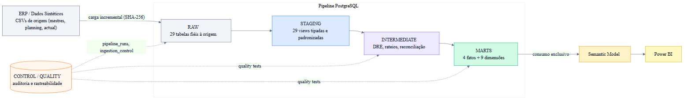
</p>

---

## Visão geral

O projeto simula o ambiente de dados de uma distribuidora B2B nacional fictícia, a **Nexa Distribuição**, com dados sintéticos gerados de forma determinística e coerente entre os módulos comercial, logístico, contábil e de planejamento.

O objetivo não é apenas construir um dashboard. A proposta é demonstrar o fluxo completo entre **origem, ingestão, qualidade, transformação, regras de negócio, modelagem dimensional e consumo analítico**.

A arquitetura implementada segue:

```text
ERP / CSVs
    ↓
RAW
    ↓
STAGING
    ↓
INTERMEDIATE
    ↓
MARTS
    ↓
Semantic Model
    ↓
Power BI
```

O pipeline financeiro e o modelo dimensional em PostgreSQL estão concluídos. As duas primeiras páginas do Power BI, Executive Financial Performance e DRE Gerencial, também já estão construídas, com modelo semântico, medidas DAX e diagnósticos interativos. Performance Drivers é a próxima página.

### Status do projeto

- pipeline de ingestão e transformação concluído;
- arquitetura em camadas validada e auditável;
- DRE Gerencial e Budget conformados;
- reconciliações comercial, logística e contábil implementadas;
- drivers de performance calculados e reconciliados;
- modelo semântico e medidas DAX das páginas Executive e DRE Gerencial concluídos;
- Power BI: Executive Financial Performance e DRE Gerencial prontas; Performance Drivers em construção.

---

## Contexto de negócio

A Nexa Distribuição apresenta crescimento de receita e volume, porém parte desse crescimento não está se convertendo na mesma proporção em resultado operacional.

O cenário foi construído para permitir uma análise realista de performance financeira, combinando:

- faturamento e descontos comerciais;
- custo das mercadorias vendidas (CMV);
- custos e subsídios logísticos;
- despesas operacionais e estrutura organizacional;
- resultado financeiro;
- orçamento independente do realizado;
- lançamentos contábeis, reversões e ajustes;
- rateios gerenciais e conciliações entre módulos.

Os dados de **Atual abrangem jan/2024 a jul/2026**, enquanto o **Budget cobre 2024 a 2026**, permitindo análises históricas, YoY, YTD e Budget vs Atual.

---

## Pergunta central

> **A empresa está crescendo de maneira rentável e quais fatores explicam os desvios entre o resultado realizado e o planejado?**

### Perguntas que o projeto deverá responder

1. Como Receita Líquida, Lucro Bruto, Resultado Operacional e Margem Operacional estão evoluindo ao longo do tempo?
2. O crescimento de receita está sendo acompanhado pelo crescimento do resultado?
3. Qual é o desvio entre **Atual e Budget** e em quais linhas da DRE ele está concentrado?
4. Quais fatores explicam o desvio operacional: **volume, preço, desconto, mix, CMV, logística, OPEX ou residual**?
5. Quais filiais, clientes, produtos ou categorias mais contribuem positiva ou negativamente para o resultado?
6. O aumento do custo logístico está relacionado à expansão regional, distância, peso, transportadoras ou maior frequência de entregas?
7. A política de descontos está pressionando receita líquida e margem em segmentos específicos?
8. As despesas administrativas estão crescendo acima ou abaixo da receita?
9. O resultado apresentado na DRE pode ser rastreado até os eventos comerciais, logísticos e contábeis de origem?
10. Quais drivers concentram a maior parte das pressões desfavoráveis em relação ao Budget?

O **resultado financeiro** é tratado como análise complementar e permanece fora do bridge operacional de drivers.

---

## Arquitetura do pipeline

### Papel de cada camada

| Camada | Responsabilidade |
|---|---|
| **RAW** | Preservar os dados da origem, histórico dos eventos e metadados de ingestão. |
| **STAGING** | Tipagem, padronização e validações estruturais sem aplicar regra de negócio. |
| **INTERMEDIATE** | Aplicar regras gerenciais: DRE, sinais, rateios, conciliações, Atual vs Budget e drivers. |
| **MARTS** | Entregar fatos e dimensões conformadas e otimizadas para análise. |
| **CONTROL / QUALITY** | Registrar execução, idempotência, testes, reconciliações e quality gates do pipeline. |

<p align="center">
  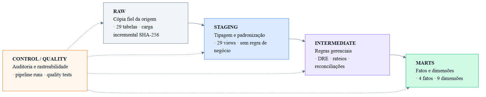
</p>

---

## Fluxo de negócio

A arquitetura mantém rastreabilidade entre a operação e o resultado financeiro:

```text
Cliente
   ↓
Pedido
   ↓
Faturamento
   ├────────→ Entrega / Logística
   └────────→ Contabilização
                  ↓
             DRE Gerencial
```

<p align="center">
  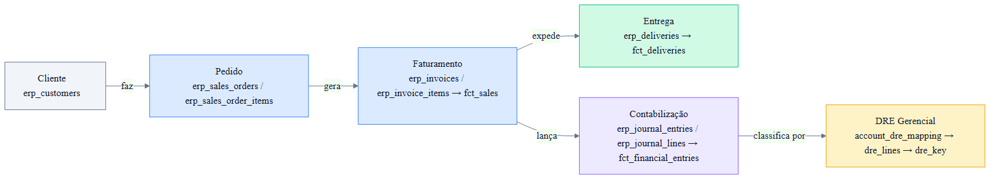
</p>

A DRE não é construída por regras `CASE` espalhadas nas consultas. O relacionamento entre **conta contábil e linha gerencial** é controlado por tabelas de mapeamento com vigência temporal.

---

## DRE Gerencial e regras de negócio

A camada `intermediate` possui **14 linhas funcionais de DRE** e mapeamento integral das **83 contas de resultado** utilizadas pelo projeto.

Entre as principais regras implementadas estão:

- normalização do sinal contábil para valor gerencial;
- mapeamento Conta Contábil → Linha DRE;
- competência financeira;
- Atual e Budget conformados às mesmas dimensões;
- rateios por `REVENUE`, `HEADCOUNT` e `FIXED_PERCENTAGE`;
- conservação integral de valor antes e depois dos rateios;
- conciliação comercial × contabilidade;
- conciliação logística × contabilidade;
- drivers operacionais de volume, preço, desconto, mix, CMV, logística, OPEX e residual;
- resultado financeiro tratado separadamente do bridge operacional.

---

## Modelo dimensional MARTS

A camada de consumo possui **7 tabelas fato e 11 dimensões conformadas**, materializadas no PostgreSQL para reduzir o custo de processamento no consumo analítico.

<p align="center">
  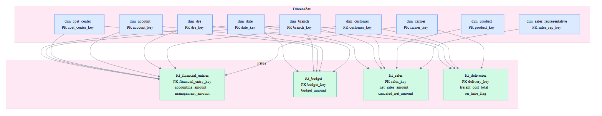
</p>

### Tabelas fato

| Tabela | Grão | Principal finalidade |
|---|---|---|
| `marts.fct_financial_entries` | lançamento financeiro/gerencial | Atual, DRE e análise contábil |
| `marts.fct_budget` | mês × conta × dimensões | Budget e variações |
| `marts.fct_sales` | item de nota fiscal | receita, preço, desconto, mix e volume |
| `marts.fct_deliveries` | entrega | frete, distância, peso, SLA e subsídio |
| `marts.fct_delivery_budget` | versão × mês × filial | Budget de entregas e comparação logística |
| `marts.fct_reconciliation` | evento conciliado entre módulos | rastreabilidade e conciliação comercial/logística × contabilidade |
| `marts.fct_performance_drivers` | mês × filial/Corporate × versão de Budget × driver | bridge operacional e explicação dos desvios |

### Dimensões

`dim_date` · `dim_branch` · `dim_account` · `dim_dre` · `dim_cost_center` · `dim_customer` · `dim_product` · `dim_carrier` · `dim_sales_representative` · `dim_budget_version` · `dim_driver`

Membros técnicos `UNKNOWN` foram implementados para preservar integridade referencial e evitar chaves nulas nas fatos. O contexto `CORPORATE` (rateio corporativo) é tratado separadamente na dimensão de filial.

<details>
<summary><strong>ERD completo por camada</strong> (todas as colunas, exportado do DBeaver)</summary>
<br>

| Camada | ERD |
|---|---|
| RAW | [raw.png](docs/Arquitetura/tecnico/raw.png) |
| STAGING | [staging.png](docs/Arquitetura/tecnico/staging.png) |
| INTERMEDIATE | [intermediate.png](docs/Arquitetura/tecnico/intermediate.png) |
| MARTS | [marts.png](docs/Arquitetura/tecnico/marts.png) |
| CONTROL | [control.png](docs/Arquitetura/tecnico/control.png) |

Diagramas de referência com todas as colunas, tipos, PKs e FKs, úteis para consulta técnica detalhada. As versões acima (`marts_dimensional_model` etc.) são a leitura recomendada para entender o modelo; estas são o detalhe completo por trás delas.

</details>

---

## Volumetria

### Ingestão RAW

- **359 arquivos** processados;
- **3.749.884 registros** inseridos;
- **0 registros rejeitados**;
- reexecução validada sem duplicação;
- controle por hash SHA-256 e metadados de ingestão.

### MARTS

| Fato | Registros |
|---|---:|
| `fct_financial_entries` | 1.389.672 |
| `fct_budget` | 26.244 |
| `fct_sales` | 615.602 |
| `fct_deliveries` | 256.857 |
| `fct_delivery_budget` | 180 |
| `fct_reconciliation` | 303.522 |
| `fct_performance_drivers` | 1.674 |

---

## Data Quality, auditoria e idempotência

Qualidade de dados é tratada como parte do pipeline e não como uma validação manual posterior.

<p align="center">
  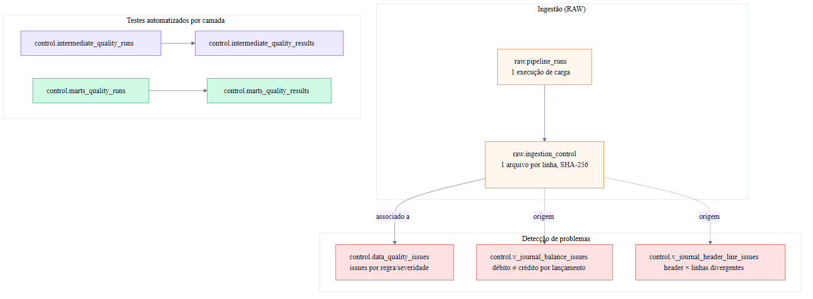
</p>

### Resultado das validações

| Camada | Resultado |
|---|---:|
| **RAW** | PASS |
| **STAGING** | **250 / 251 PASS** |
| **INTERMEDIATE** | **28 / 28 PASS** |
| **MARTS** | **48 / 48 PASS** |
| **Budget de Entregas** (extensão) | **10 / 10 PASS** |

> O único teste não-PASS em STAGING (`expected_view_set`) é uma checagem estrutural do pipeline principal que ainda não reconhece a view `stg_budget_delivery_plan`, criada pelo módulo de extensão `fpa_delivery_budget`. Essa view tem sua própria suíte de validação (linha "Budget de Entregas" acima, 10/10 PASS); não é uma falha de qualidade de dado.

Também foram validados:

- balanço entre débito e crédito;
- integridade entre headers e linhas contábeis;
- PKs, FKs e relacionamentos;
- ausência de registros órfãos nas MARTS;
- reconciliações financeiras, comerciais e logísticas;
- Budget reconciliado;
- conservação de valor dos rateios com diferença consolidada igual a zero;
- idempotência em reaplicações do pipeline;
- rastreabilidade das execuções e quality runs.

---

## Stack utilizada

- **PostgreSQL**: armazenamento, transformação e MARTS;
- **Python**: geração/ingestão dos dados e automações do pipeline;
- **SQL**: modelagem, transformação, regras gerenciais e validações;
- **Docker**: execução local reproduzível do ambiente;
- **DBeaver**: administração, consultas e inspeção dos modelos;
- **Git / GitHub**: versionamento e documentação;
- **Power BI**: modelo semântico, medidas DAX e visualização analítica.

---

## Estrutura do repositório

```text
database/
├── fpa_raw/                  ingestão, schemas e validações da RAW
├── fpa_staging/              views tipadas e padronizadas
├── fpa_intermediate/         DRE, regras, reconciliações, rateios e drivers
├── fpa_marts/                fatos, dimensões e materialização analítica
└── README.md                 execução local e detalhes técnicos

docs/
├── guias/                    dossiê e documentação física do banco
└── Arquitetura/
    ├── tecnico/              diagramas completos para documentação/GitHub
    ├── apresentacao/         diagramas 1080×1350 para LinkedIn/portfólio
    └── power-bi/
        ├── pagina-1/         prints da Executive Financial Performance
        └── pagina-2/         prints da DRE Gerencial
```

> Consulte [`database/README.md`](database/README.md) para detalhes de implementação, comandos de execução e validação local.

---

## Diagramas disponíveis

| Diagrama | Objetivo |
|---|---|
| `architecture_overview` | Arquitetura completa da origem ao Power BI |
| `layer_responsibilities` | Responsabilidade de RAW, STAGING, INTERMEDIATE, MARTS e CONTROL |
| `business_flow` | Fluxo Cliente → Pedido → Faturamento → Logística/Contabilidade → DRE |
| `marts_dimensional_model` | Modelo dimensional com 7 fatos e 11 dimensões |
| `data_quality_governance` | Auditoria, testes, reconciliações e quality gate |

Cada diagrama acima tem uma versão técnica (horizontal, em `docs/Arquitetura/tecnico/`) e uma versão de apresentação (vertical 1080×1350, em `docs/Arquitetura/apresentacao/`), pronta para carrossel no LinkedIn e portfólio:

<p align="center">
  <a href="docs/Arquitetura/apresentacao/architecture_overview.png">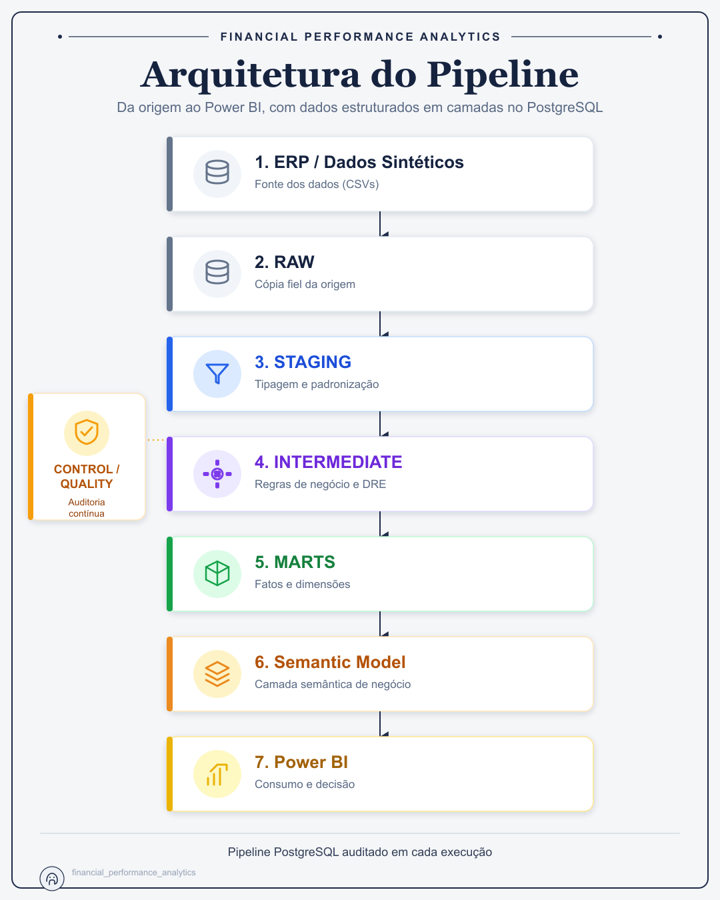</a>
  <a href="docs/Arquitetura/apresentacao/layer_responsibilities.png">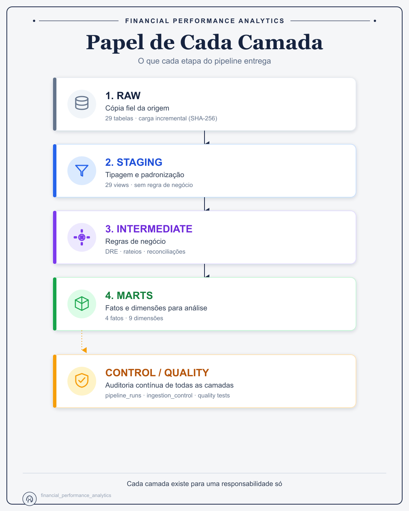</a>
  <a href="docs/Arquitetura/apresentacao/business_flow.png">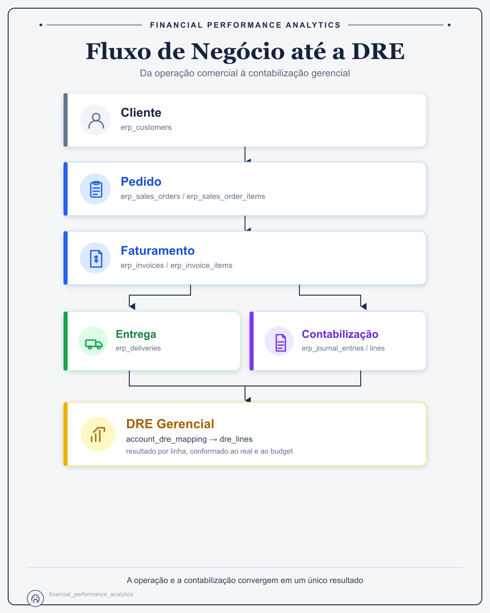</a>
  <a href="docs/Arquitetura/apresentacao/marts_dimensional_model.png">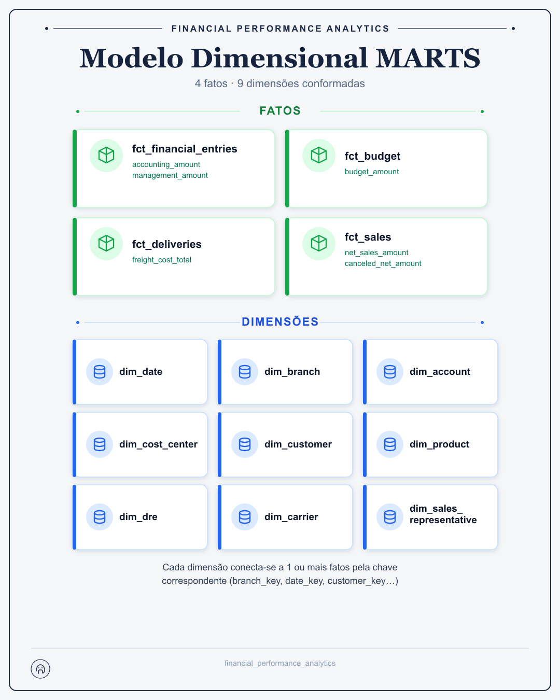</a>
  <a href="docs/Arquitetura/apresentacao/data_quality_governance.png">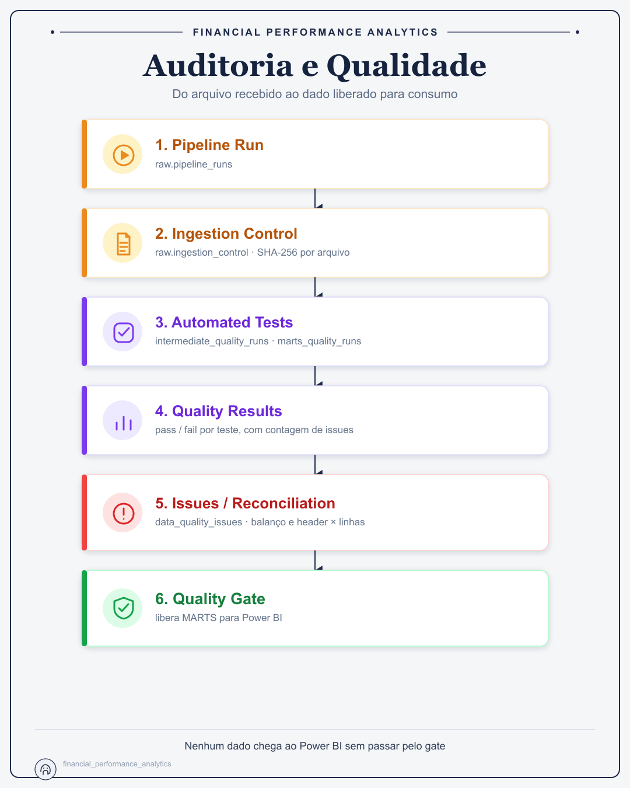</a>
</p>

---

## Dados

As bases utilizadas são **sintéticas** e foram construídas para preservar coerência entre os diferentes módulos do projeto. Os arquivos-fonte não são versionados no GitHub devido à volumetria.

A carga é executada localmente pelos scripts do projeto, preservando controles de arquivo, hash, quantidade de registros, status da execução e rastreabilidade.

---

## Power BI

O Power BI consome a camada `marts` e é orientado a três perguntas analíticas principais:

1. **Executive Financial Performance**: como receita, resultado e margens estão evoluindo? *(pronta)*
2. **DRE Gerencial**: onde estão os principais desvios entre Atual e Budget? *(pronta)*
3. **Performance Drivers**: quais fatores explicam esses desvios e onde agir? *(próxima página)*

O modelo semântico é enxuto, com medidas DAX focadas em análise e storytelling, deixando as regras complexas de transformação no PostgreSQL.

<p align="center">
  <a href="https://app.powerbi.com/view?r=eyJrIjoiN2IxZWIxNzEtYmFlNy00MjMwLWI4MzQtOTM4NDg3NzdjMjJlIiwidCI6IjMxMGJmZTRmLWUyMTQtNDUzZC04ZTM1LWM5YmYzYzM4MWQyMSJ9"><strong>Ver relatório publicado no Power BI →</strong></a>
</p>

### Executive Financial Performance

Visão executiva com Atual vs Budget, evolução mensal, desvio por filial, principais drivers de pressão e atingimento de meta. Os cards de KPI usam formatação condicional (verde/vermelho) para margem, variação e crescimento, e os gráficos de desvio têm diagnóstico interativo por clique, mostrando o contexto completo do mês ou da filial selecionada.

<p align="center">
  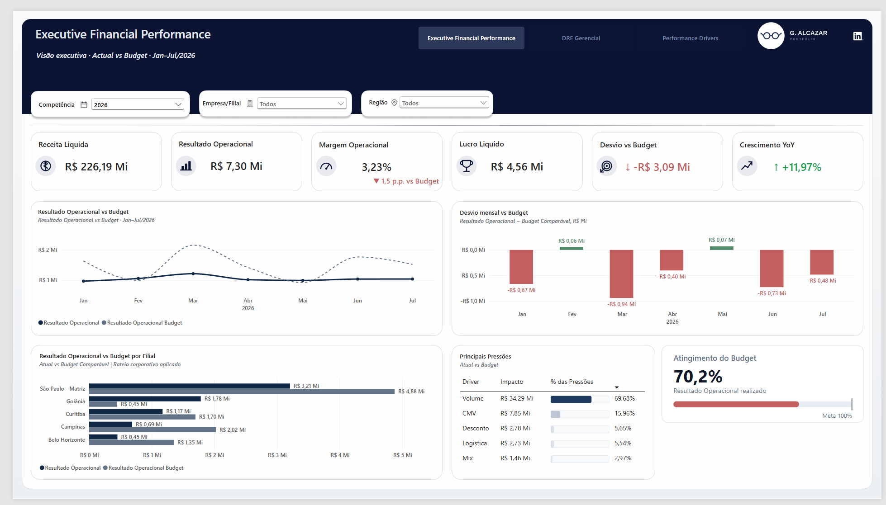
</p>

<p align="center">
  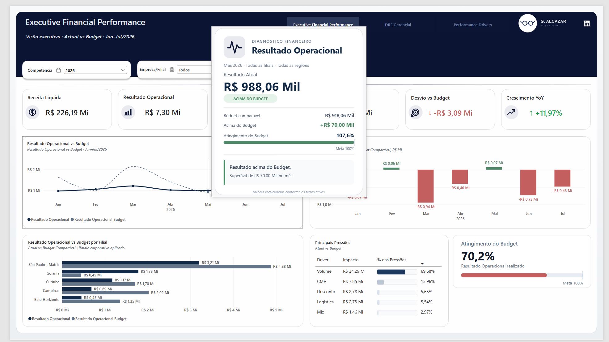
  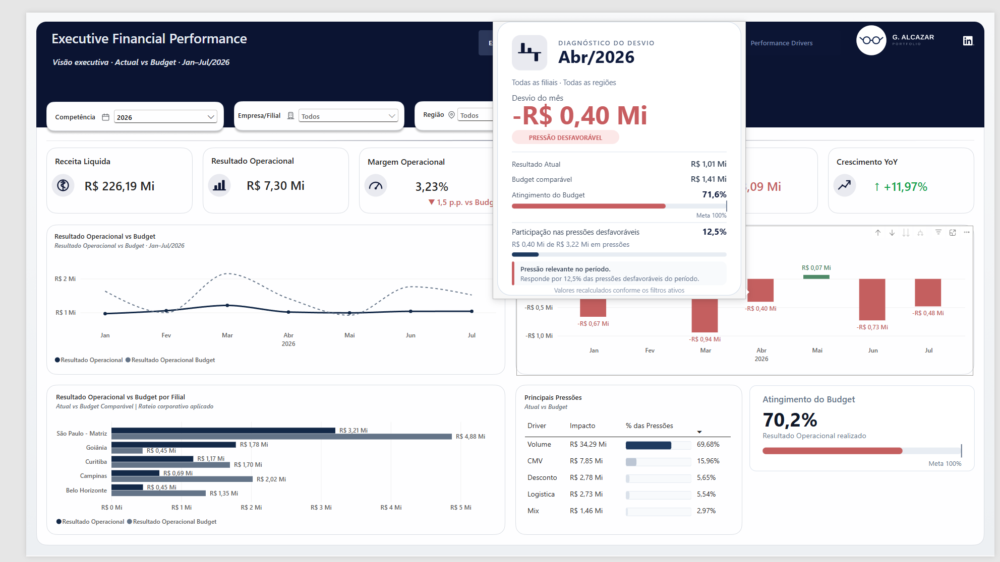
</p>

### DRE Gerencial

Formação do resultado com Atual vs Budget comparável, contendo apenas o período em que existem dados realizados, mesmo quando o Budget cobre um intervalo maior. A matriz alterna o detalhamento entre Centro de Custo e Conta Contábil através de um parâmetro de campos, sem duplicar visual nem medidas, e os filtros de Centro de Custo e Conta Contábil ficam num painel de filtros avançados separado, mantendo a página principal limpa.

<p align="center">
  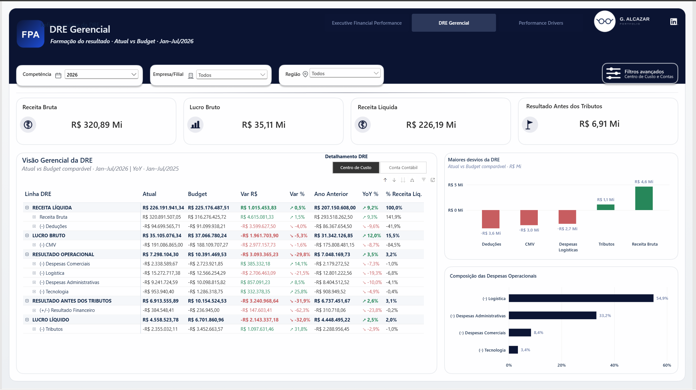
</p>

<p align="center">
  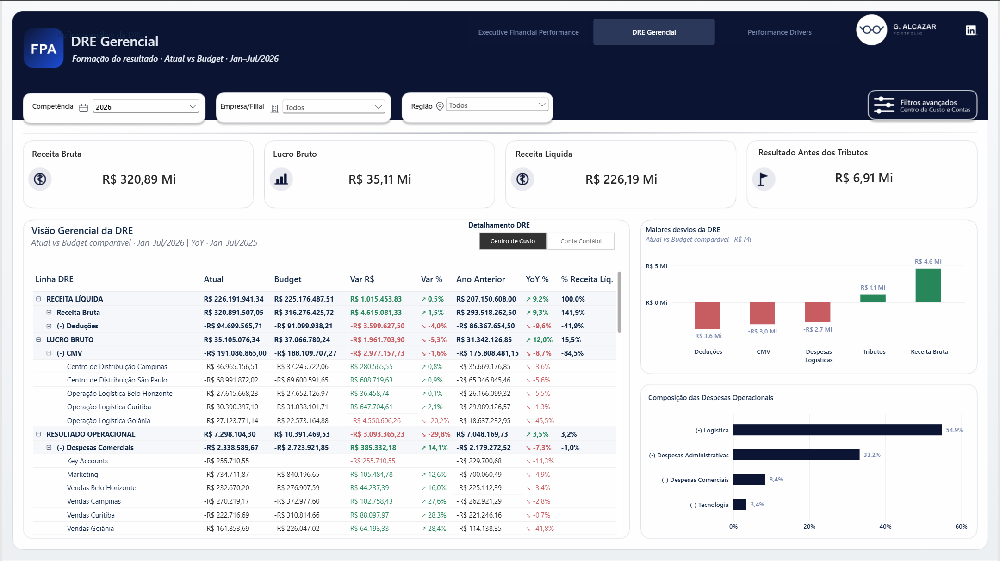
  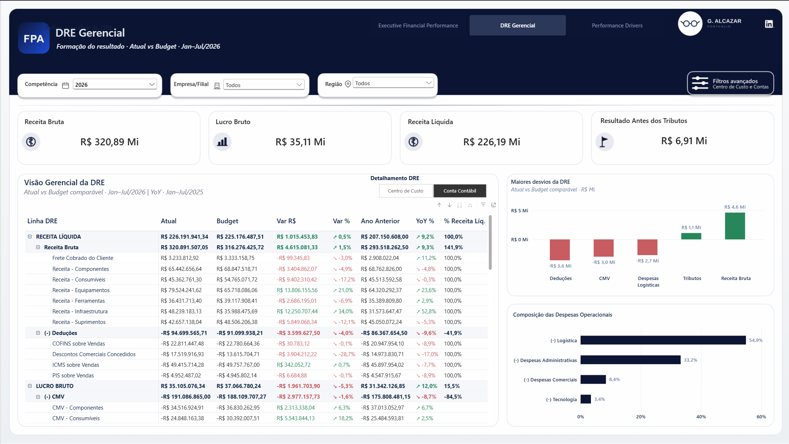
</p>

<p align="center">
  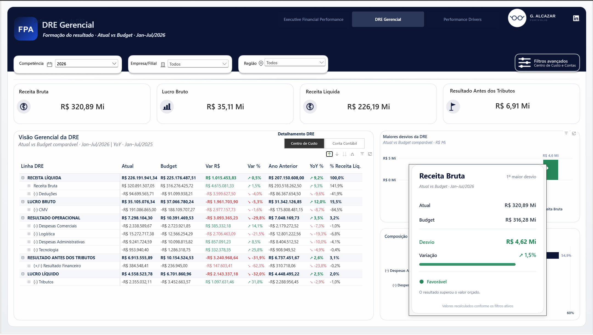
  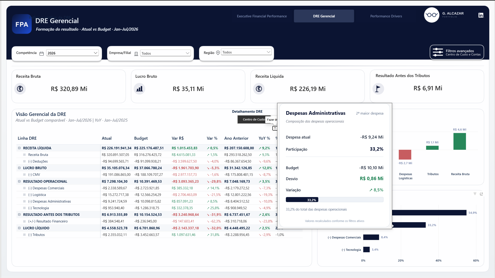
</p>

<details>
<summary><strong>Filtros avançados de Centro de Custo e Conta Contábil</strong></summary>
<br>

<p align="center">
  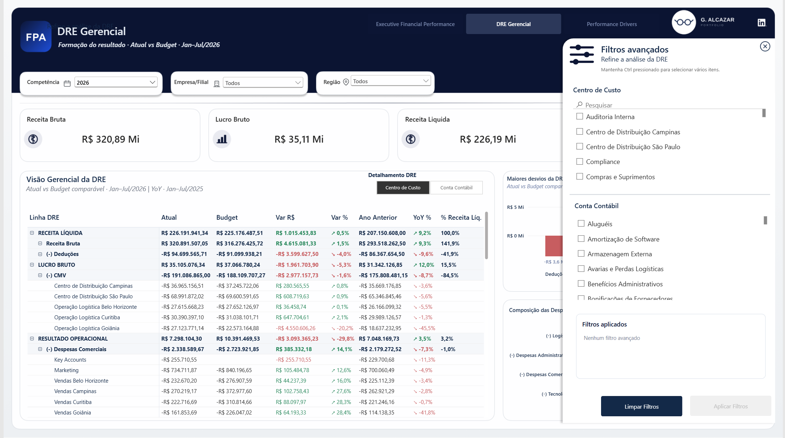
  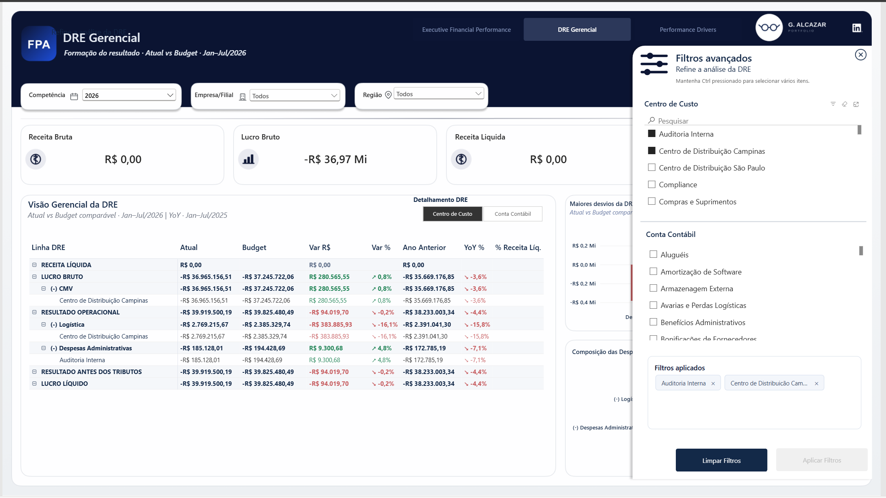
</p>

</details>

#### Otimização de performance da matriz

A matriz da DRE é o visual mais exigente da página, sete medidas por linha, hierarquia de até quatro níveis e um plano de apresentação (`dim_dre_layout`) desconectado das tabelas fato para permitir subtotal nativo e cores de linha inteira na Matriz. Essa combinação foi validada e otimizada com medição real, usando o Performance Analyzer do Power BI Desktop e consultas cronometradas direto no motor semântico:

- medidas mantidas como valores numéricos, com formatação dinâmica em vez de `FORMAT()`, preservando ordenação e permitindo formatação condicional nativa;
- cores de variação e YoY trocadas de medida DAX para regra de formatação condicional, eliminando a reavaliação de uma medida extra por célula;
- `ISINSCOPE()` para identificar o nível da hierarquia (seção, linha, centro de custo ou conta) e interromper o cálculo antes de acionar a lógica financeira quando a linha não deve ser exibida;
- `REMOVEFILTERS()` aplicado apenas sobre `dim_dre`, nunca sobre o modelo inteiro;
- `TREATAS()` para aplicar o código da linha sobre a dimensão financeira sem relacionamento físico entre as tabelas de apresentação e de fato;
- parâmetro de campos para alternar Centro de Custo e Conta Contábil na mesma matriz, evitando que as duas dimensões fossem cruzadas ao mesmo tempo;
- remoção das tabelas de data automáticas, geradas por padrão pelo Power BI para cada coluna de data do modelo.

| Cenário | Antes | Depois |
|---|---:|---:|
| Matriz completa (Centro × Conta simultâneos) | 1.621 ms | cenário eliminado pelo parâmetro de campos |
| Matriz expandida, uso real (Performance Analyzer) | acima de 1.600 ms no pior caso | 400 a 1.073 ms conforme quantidade de seções abertas |
| Cores por medida DAX vs regra nativa | 797 ms / 278 MB | 524 ms / 168 MB (≈ 40% de ganho) |

Em todos os cenários medidos, entre 86% e 98% do tempo total está no Formula Engine, confirmando que o custo é de cálculo, não de volume de dado, os fatos envolvidos somam mais de 1,3 milhão de linhas e respondem em poucos milissegundos quando a medida é simples.

---

## O que este projeto demonstra

Mais do que uma visualização financeira, este projeto busca demonstrar capacidade de trabalhar no ciclo completo do dado:

**ingestão → qualidade → SQL → modelagem → regras de negócio → reconciliação → modelo dimensional → analytics**.

O Power BI é a camada de consumo de uma arquitetura já validada, auditável e preparada para análise.
