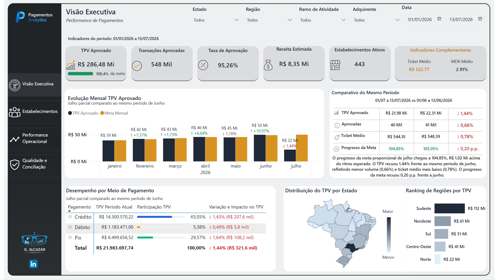
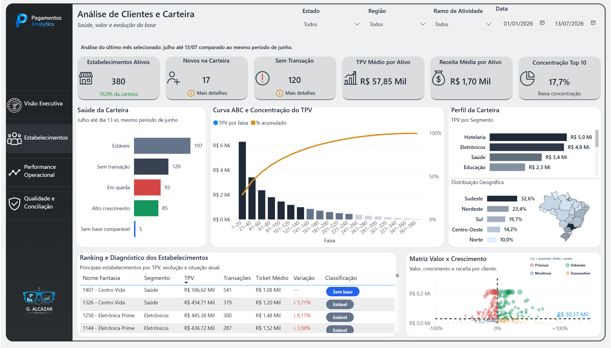
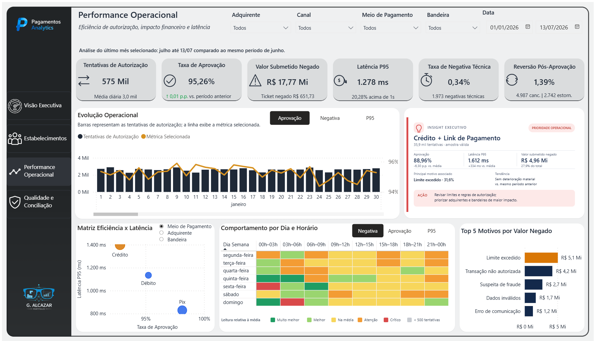
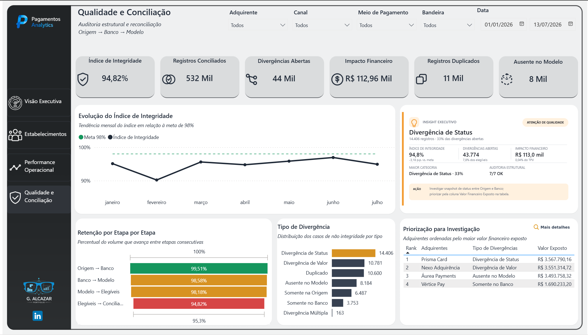
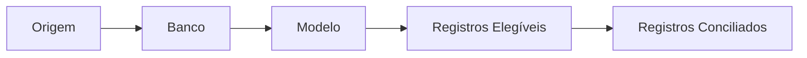
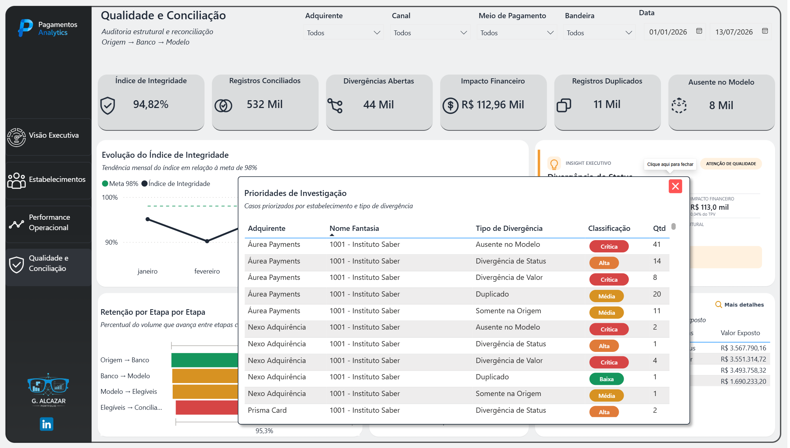

# 💳 Pagamentos Analytics

Projeto de Business Intelligence desenvolvido em **Power BI** para simular o ambiente analítico de uma empresa do setor de meios de pagamento.

A solução foi construída com dados sintéticos e percorre o processo completo de um projeto de dados: organização das fontes, tratamento no Power Query, modelagem semântica, criação de medidas em DAX, desenvolvimento dos dashboards, validação dos indicadores e documentação das regras de negócio.

## 🔗 Acesso ao dashboard

🔗 [Visualizar o dashboard publicado no Power BI](https://app.powerbi.com/view?r=eyJrIjoiNGU1NzA5NWQtNDU1Ny00Yjg0LWJjODktYTc3MjRmZGRlZWYxIiwidCI6IjMxMGJmZTRmLWUyMTQtNDUzZC04ZTM1LWM5YmYzYzM4MWQyMSJ9) — publicado em 07/08/2026

## ✅ Status do projeto

- [x] Página 1 — Visão Executiva
- [x] Página 2 — Análise de Clientes e Carteira
- [x] Página 3 — Performance Operacional
- [x] Página 4 — Qualidade e Conciliação
- [x] Revisão final e limpeza do modelo

> **Projeto finalizado (07/08/2026):** as quatro páginas do dashboard estão concluídas, com as regras de negócio validadas e o modelo revisado. O arquivo `.pbix` publicado corresponde à versão final de portfólio.

### Imagens utilizadas no README

O README apresenta a imagem principal de cada página:

- `Imagens/1_Visão_Executiva.png`
- `Imagens/2_Estabelecimentos.png`
- `Imagens/3_Operacional.png`
- `Imagens/4_Qualidade.png`

Os arquivos com numeração adicional no final, como `_1` e `_2`, registram tooltips, interações e detalhes complementares do desenvolvimento. Na Página 4, o arquivo `4_Qualidade_2.png` também é apresentado no README por documentar o painel retrátil de investigação, uma das principais interações da solução.

## 🎯 Objetivo

O projeto foi criado para demonstrar conhecimentos técnicos e de negócio aplicados ao setor de pagamentos, com foco em:

- análise de TPV e volume transacional;
- acompanhamento de metas;
- taxa de aprovação;
- receita e MDR;
- análise da carteira de estabelecimentos;
- ativação, inatividade e saúde transacional;
- concentração da carteira;
- motivos de negativa;
- latência e eficiência operacional;
- qualidade e conciliação de dados;
- identificação de divergências, duplicidades e ausências entre camadas;
- priorização de investigação por exposição financeira;
- comparação temporal;
- criação de diagnósticos e recomendações acionáveis.

## 🧰 Tecnologias utilizadas

- Power BI Desktop
- Power Query M
- DAX
- Modelagem dimensional
- SVG
- CSV
- Power BI Service
- Git e GitHub

## 🏗️ Arquitetura do projeto


## 🗂️ Dados utilizados

O projeto utiliza dados sintéticos de portfólio.

A base principal contém aproximadamente:

- 583 mil transações;
- 500 estabelecimentos;
- período entre 01/01/2026 e 13/07/2026;
- 10 segmentos;
- 27 estados;
- 5 regiões;
- 6 parceiros;
- 18 representantes.

Também foram utilizadas dimensões auxiliares de:

- adquirentes;
- bandeiras;
- meios de pagamento;
- canais de captura;
- status da transação;
- motivos de negativa;
- calendário;
- metas mensais.

## ⚙️ Processo de desenvolvimento

### 1. Organização das fontes

Os arquivos CSV foram organizados em uma pasta única de origem.

No Power Query, foi criada uma consulta-base para localizar os arquivos e uma função reutilizável para centralizar:

- leitura dos CSVs;
- delimitador e codificação;
- promoção de cabeçalhos;
- limpeza de colunas;
- tipagem inicial;
- validação dos arquivos.

O caminho principal da fonte foi centralizado para facilitar a migração do projeto entre computadores e diretórios.

### 2. Tratamento e validação

Durante o ETL foram revisados campos críticos, como:

- identificadores;
- documentos;
- NSU;
- autorização;
- data e hora;
- valores monetários;
- número de série;
- status;
- motivos de negativa.

Também foram aplicadas regras para evitar duplicidades, manter a consistência dos relacionamentos e garantir que os indicadores fossem reconciliáveis.

### 3. Modelagem semântica

O modelo foi estruturado com uma fato transacional central e dimensões relacionadas.

Principais tabelas:

| Tabela | Finalidade |
|---|---|
| `f_Transacoes` | Fato principal com os dados transacionais |
| `d_Estabelecimentos` | Informações comerciais e cadastrais |
| `d_Calendario` | Comparações temporais e períodos dinâmicos |
| `f_Metas` | Metas mensais de TPV |
| Dimensões auxiliares | Adquirente, bandeira, canal, meio de pagamento, status e motivo |

As medidas foram organizadas em pastas lógicas para facilitar manutenção, auditoria e evolução do modelo.

---

# 📊 Página 1 — Visão Executiva



A primeira página foi criada para apresentar uma visão consolidada do desempenho do negócio.

## Principais perguntas respondidas

- Quanto foi processado no período?
- A meta está sendo atingida?
- Como o resultado evoluiu ao longo dos meses?
- O que explica o crescimento ou a queda do TPV?
- Quais meios de pagamento, estados e regiões possuem maior participação?

## Indicadores e análises

- TPV aprovado;
- transações aprovadas;
- taxa de aprovação;
- receita estimada;
- estabelecimentos ativos;
- ticket médio;
- MDR médio;
- evolução mensal do TPV;
- comparação com a meta;
- desempenho por meio de pagamento;
- distribuição geográfica;
- ranking de regiões.

## Decisões importantes

A meta utilizada no projeto é global. Quando filtros comerciais são aplicados, os indicadores de meta são ocultados para evitar uma comparação incorreta entre um recorte segmentado e uma meta corporativa.

Para meses em aberto, o resultado é comparado com o mesmo intervalo do mês anterior. Para meses fechados, a comparação é feita contra o mês anterior completo.

---

# 👥 Página 2 — Análise de Clientes e Carteira



A segunda página foi desenvolvida para aprofundar a análise comercial da carteira de estabelecimentos.

## Principais perguntas respondidas

- Qual é o tamanho da carteira?
- Quantos clientes são recentes?
- Quantos ainda não transacionaram?
- Onde existe concentração?
- Quais estabelecimentos estão crescendo ou caindo?
- Quais clientes devem receber prioridade comercial?

## Indicadores e análises

- estabelecimentos ativos;
- novos na carteira;
- clientes sem transação;
- TPV médio por ativo;
- receita média por ativo;
- concentração do Top 10;
- saúde transacional;
- Curva ABC e Pareto;
- perfil da carteira por segmento e região;
- ranking de estabelecimentos;
- Matriz Valor × Crescimento.

## Classificação da saúde da carteira

A classificação foi construída de forma mutuamente exclusiva:

1. Primeira ativação;
2. Sem transação no período;
3. Sem base comparável;
4. Reativado;
5. Alto crescimento;
6. Em queda;
7. Estável.

Foram separadas três camadas que não devem ser confundidas:

- **Cadastro:** quando o cliente entrou na carteira;
- **Ativação:** se já realizou alguma transação aprovada;
- **Movimento atual:** se possui transações aprovadas no período analisado.

## Curva ABC e Pareto

Os estabelecimentos foram ordenados por TPV e agrupados em faixas de ranking.

A análise permite avaliar:

- concentração do volume financeiro;
- quantidade de clientes necessária para atingir os principais percentuais acumulados;
- dependência excessiva de poucos estabelecimentos;
- distribuição entre classes A, B e C.

## Matriz Valor × Crescimento

A matriz cruza:

- variação comparável de TPV;
- TPV atual;
- receita estimada;
- mediana dinâmica da carteira.

Os quadrantes foram utilizados para classificar os estabelecimentos entre:

- priorizar;
- defender;
- monitorar;
- desenvolver.

---

# ⚡ Página 3 — Performance Operacional



A terceira página foi desenvolvida para explicar a eficiência operacional das transações.

O objetivo foi ir além do volume processado e analisar:

- eficiência das autorizações;
- impacto financeiro das negativas;
- latência;
- negativas técnicas;
- reversões;
- comportamento por dia e horário;
- causas operacionais;
- dimensões que exigem prioridade.

## Indicadores principais

- tentativas de autorização;
- taxa de aprovação;
- valor submetido negado;
- latência P95;
- taxa de negativa técnica;
- reversão pós-aprovação.

## Evolução operacional

As barras representam as tentativas de autorização e a linha exibe a métrica selecionada.

O usuário pode alternar entre:

- aprovação;
- negativa;
- P95.

Os tooltips apresentam uma leitura diária com:

- valor do ponto;
- comparação com o dia anterior;
- tentativas;
- aprovação;
- latência;
- valor negado;
- diagnóstico operacional.

## Matriz Eficiência × Latência

A matriz permite comparar:

- meios de pagamento;
- adquirentes;
- bandeiras.

Cada ponto considera:

- taxa de aprovação;
- latência P95;
- valor negado;
- quantidade de tentativas;
- confiabilidade da amostra;
- comparação com a referência do contexto.

O tooltip foi desenvolvido para apresentar participação, deltas, diagnóstico e recomendação sem sobrecarregar a página principal.

## Mapa de calor por dia e horário

O mapa de calor foi um dos novos recursos explorados neste projeto.

Ele distribui a performance entre:

- dias da semana;
- faixas horárias de três horas.

A classificação é relativa à média do contexto e utiliza categorias como:

- muito melhor;
- melhor;
- na média;
- atenção;
- crítico;
- amostra insuficiente.

O limite mínimo de tentativas é aplicado antes da classificação, evitando conclusões baseadas em volumes pouco representativos.

## Ranking dos motivos de negativa

O ranking permite alternar a métrica analisada e identifica os principais motivos de negativa por impacto.

O primeiro colocado recebe destaque em âmbar e os demais itens do Top 5 permanecem em azul-marinho.

O tooltip apresenta:

- posição no ranking;
- valor negado;
- participação;
- quantidade de negativas;
- ticket médio;
- concentração dos três primeiros motivos;
- ação sugerida.

## Insight Executivo

O insight executivo identifica combinações prioritárias entre dimensões do modelo.

Na versão atual, a combinação de **Crédito + Link de Pagamento** apresentou:

- volume relevante de tentativas;
- aprovação abaixo da média;
- latência elevada;
- participação significativa no valor negado;
- concentração do motivo “Limite excedido”.

O objetivo do insight não é apenas apontar o problema, mas também apresentar uma ação recomendada.

## Comparação temporal

Os indicadores principais respeitam todo o período filtrado.

As comparações e tendências utilizam o último mês selecionado como referência:

- mês fechado contra o mês anterior completo;
- mês em aberto contra o mesmo intervalo do mês anterior.

Exemplo:

- atual: 01/07 a 13/07;
- anterior: 01/06 a 13/06.

Quando não existe histórico suficiente para realizar uma comparação completa, o modelo retorna:

> Sem período anterior comparável

Essa regra evita comparações sobrepostas ou metodologicamente inconsistentes.

## Validações realizadas

Os principais indicadores foram reconciliados antes da finalização da página.

Exemplos de validação:

- tentativas = aprovadas + negadas;
- taxa de aprovação reconciliada com a quantidade de transações;
- negativas técnicas reconciliadas com a taxa exibida;
- P95 calculado diretamente sobre as tentativas válidas;
- ranking validado com participação correta;
- concentração dos três principais motivos validada;
- referências da Matriz Eficiência × Latência corrigidas;
- contextos dos tooltips revisados para evitar resultados artificiais de 100%.

---


# 🔍 Página 4 — Qualidade e Conciliação



A quarta página foi desenvolvida para simular uma camada de **Data Quality, auditoria e conciliação** dentro do projeto.

O objetivo foi comparar a passagem do dado entre três estágios lógicos:

**Origem → Banco → Modelo**

A estrutura de conciliação foi mantida isolada da fato transacional utilizada nas páginas anteriores. Dessa forma, as simulações de divergência e as regras de qualidade não alteram os indicadores executivos, comerciais ou operacionais já construídos.

## Principais perguntas respondidas

- Qual percentual dos registros permanece íntegro após percorrer todas as etapas?
- Onde ocorre a maior perda entre Origem, Banco e Modelo?
- Quais tipos de divergência concentram mais ocorrências?
- Qual é o impacto financeiro efetivamente apurado pelas diferenças de valor?
- Qual volume financeiro está exposto em registros que exigem investigação?
- Quais adquirentes e estabelecimentos devem ser investigados primeiro?

## Arquitetura da conciliação

A página representa o processo de forma sequencial:



As regras verificam presença, duplicidade, status e valor entre as camadas. A classificação foi construída com precedência para evitar que o mesmo registro seja contabilizado simultaneamente em mais de uma categoria principal.

Entre as classificações previstas estão:

- Registro Inválido;
- Duplicado;
- Pendente de Carga;
- Somente na Origem;
- Somente no Banco;
- Ausente no Modelo;
- Divergência Múltipla;
- Divergência de Valor;
- Divergência de Status;
- Conciliado.

**Pendente de Carga** representa um registro que ainda está dentro do SLA esperado de processamento. Por isso, enquanto permanece dentro da janela definida, não é tratado como erro e não entra no total de divergências abertas.

## Indicadores principais

A camada executiva da página foi construída com seis indicadores:

- **Índice de Integridade:** percentual dos registros elegíveis que chegaram ao estado conciliado;
- **Registros Conciliados:** volume que percorreu as validações sem divergência;
- **Divergências Abertas:** casos que exigem análise ou correção, desconsiderando pendências ainda dentro do SLA;
- **Impacto Financeiro:** diferença financeira efetivamente apurada quando os valores entre as camadas não coincidem;
- **Registros Duplicados:** ocorrências identificadas mais de uma vez no processo;
- **Ausente no Modelo:** registros presentes nas etapas anteriores, mas não localizados na camada analítica após o prazo esperado.

Uma decisão importante foi separar **Impacto Financeiro** de **Valor Financeiro Exposto**.

O primeiro representa a diferença monetária comprovada em registros com divergência de valor. Já o segundo representa o valor associado aos registros que estão sob risco ou investigação, mesmo quando não existe uma diferença monetária direta. O Valor Financeiro Exposto é utilizado principalmente na priorização operacional.

## Evolução do Índice de Integridade

O gráfico de evolução acompanha mensalmente o Índice de Integridade e utiliza uma meta de referência de **98%**.

A intenção é identificar deterioração ou recuperação da qualidade ao longo do tempo, mantendo a leitura temporal separada da análise causal apresentada nos demais visuais.

## Retenção por Etapa

O visual de retenção mostra quanto do volume consegue avançar entre etapas consecutivas:

- Origem → Banco;
- Banco → Modelo;
- Modelo → Elegíveis;
- Elegíveis → Conciliados.

Em vez de utilizar apenas um funil tradicional, foram criadas medidas específicas de retenção entre cada estágio. Isso permite identificar em qual ponto do processo ocorre a maior perda de eficiência.

As cores são condicionais e funcionam como sinalização visual de qualidade, utilizando verde, âmbar e vermelho conforme o desempenho da etapa.

## Tipos de Divergência

O ranking de divergências apresenta os casos de não integridade ordenados por quantidade.

Essa análise responde à pergunta **“qual é a principal causa da perda de integridade?”**, separando problemas como divergência de status, divergência de valor, duplicidade, ausência no modelo e registros presentes em apenas uma das camadas.

O maior tipo de divergência recebe destaque visual, enquanto os demais permanecem em grafite para preservar a hierarquia da página.

## Insight Executivo

O bloco de Insight Executivo resume automaticamente o principal ponto de atenção do contexto filtrado.

Ele combina:

- Índice de Integridade;
- divergências abertas;
- impacto financeiro;
- maior categoria de divergência;
- auditoria estrutural;
- ação recomendada.

A proposta é transformar os indicadores em uma leitura acionável, direcionando o usuário para o próximo passo de investigação.

## Priorização para Investigação

A priorização utiliza o **Valor Financeiro Exposto** para ordenar as adquirentes que merecem atenção primeiro.

O ranking apresenta:

- posição;
- adquirente;
- principal tipo de divergência;
- valor financeiro exposto.

Essa visão é propositalmente resumida. O objetivo é evitar uma tabela operacional muito extensa na página principal e deixar o detalhamento disponível somente quando necessário.

## Painel retrátil de investigação



Uma das principais interações da Página 4 é o **painel retrátil de investigação**, aberto a partir do botão de detalhamento do ranking.

O painel foi construído como uma camada sobreposta à página e permite aprofundar a análise sem exigir uma nova página de relatório. A interação utiliza controle de visibilidade e navegação por bookmark, mantendo a visão executiva limpa quando o detalhe não é necessário.

A tabela de investigação apresenta:

- adquirente;
- nome fantasia do estabelecimento;
- tipo de divergência;
- classificação de prioridade;
- quantidade de casos.

As prioridades são representadas por classificações como **Crítica, Alta, Média e Baixa**, utilizando cores semânticas para facilitar a leitura.

Essa estrutura cria duas camadas de análise:

**Visão executiva → Ranking de prioridade → Investigação detalhada**

Assim, o usuário pode começar pelo impacto geral e chegar aos casos específicos sem sobrecarregar o dashboard principal.

## Tooltip técnico de investigação

A investigação é complementada por um tooltip contextual desenvolvido para apresentar informações adicionais somente quando o usuário precisa aprofundar um caso.

Entre os elementos apresentados estão:

- quantidade de casos;
- posição no ranking de priorização;
- prioridade;
- valor financeiro exposto;
- participação no valor exposto da adquirente;
- impacto financeiro apurado;
- situação do SLA;
- presença do registro em Origem, Banco e Modelo;
- ação recomendada.

O SLA também respeita o tipo de divergência. Casos de ausência entre etapas podem ser avaliados contra a janela esperada de processamento, enquanto divergências de valor, status ou duplicidade podem receber a indicação de que o SLA não se aplica.

## Decisões de modelagem e performance

A página foi construída com algumas decisões para evitar que o detalhamento prejudicasse a experiência do relatório:

- a lógica de conciliação foi isolada das páginas 1, 2 e 3;
- a página principal mantém a leitura executiva e delega o detalhe ao painel retrátil e aos tooltips;
- SVG foi utilizado de forma pontual para enriquecer diagnósticos e elementos de apoio;
- visuais nativos foram mantidos sempre que atendiam bem à análise;
- medidas de retenção foram calculadas por etapa para evitar interpretações incorretas de um funil genérico;
- filtros de data, adquirente, canal, meio de pagamento e bandeira preservam o contexto da investigação.

## Validações da conciliação

As principais regras foram revisadas para garantir consistência entre os indicadores e as classificações:

- um registro dentro do SLA não é tratado como divergência aberta;
- a comparação de status considera o mesmo instante de referência entre as camadas;
- registros duplicados são tratados separadamente das demais divergências;
- Impacto Financeiro e Valor Financeiro Exposto possuem finalidades diferentes;
- o Índice de Integridade é reconciliado com o volume elegível e conciliado;
- ranking, painel retrátil e tooltip respeitam o contexto aplicado pelos filtros.

---
# 🖼️ Uso de SVG

O SVG foi utilizado de forma estratégica para complementar os visuais nativos do Power BI.

Principais aplicações:

- tooltips personalizados;
- barras de participação;
- diagnósticos;
- indicadores de confiabilidade;
- recomendações;
- elementos visuais pontuais.

A intenção não foi substituir todos os gráficos por SVG, mas entregar mais informações no contexto da análise sem adicionar muitos visuais à página.

Essa abordagem ajuda a:

- manter o dashboard organizado;
- reduzir poluição visual;
- aprofundar a análise;
- preservar a performance;
- criar uma experiência mais personalizada.

# 🎨 Sistema visual

O dashboard utiliza o seguinte padrão:

| Elemento | Padrão |
|---|---|
| Fundo geral | `#F1F2F2` |
| Navegação | Antracito |
| Cor principal | Azul-marinho e grafite |
| Atenção | Âmbar |
| Positivo | Verde |
| Negativo | Vermelho |
| Cards | Cinza claro, cantos arredondados e borda inferior marcada |
| Textos | Títulos curtos e detalhes em subtítulos ou tooltips |

# 📁 Estrutura do repositório

```text
Projetos_Power-BI/
└── pagamentos-analytics/
    ├── README.md
    ├── Imagens/
    │   ├── 1_Visão_Executiva.png
    │   ├── 2_Estabelecimentos.png
    │   ├── 2_Estabelecimentos_1.png
    │   ├── 2_Estabelecimentos_2.png
    │   ├── 3_Operacional.png
    │   ├── 3_Operacional_1.png
    │   ├── 3_Operacional_2.png
    │   ├── 4_Qualidade.png
    │   ├── 4_Qualidade_1.png
    │   └── 4_Qualidade_2.png
    └── PagamentosAnalytics.pbix
```

# ▶️ Como abrir o projeto

1. Faça o download de `PagamentosAnalytics.pbix`.
2. Abra o arquivo no Power BI Desktop.
3. Caso necessário, ajuste o caminho das fontes CSV no Power Query.
4. Atualize os dados.
5. Navegue entre as páginas utilizando o menu lateral.

# ⚠️ Cuidados com os dados

Todos os dados utilizados neste projeto são sintéticos e foram criados exclusivamente para fins de portfólio.

O arquivo publicado não deve conter:

- credenciais;
- tokens;
- chaves de API;
- documentos reais;
- informações pessoais;
- dados confidenciais de empresas ou clientes.

# 🏁 Etapa final

Com as quatro páginas concluídas, o projeto passou por uma revisão técnica final antes da consolidação da versão de portfólio, com foco em:

- remoção de medidas DAX auxiliares e objetos de teste;
- revisão de nomes e pastas de medidas;
- validação de bookmarks, tooltips e interações;
- revisão de relacionamentos e colunas não utilizadas;
- documentação das regras finais de qualidade e conciliação;
- validação final antes da publicação da versão consolidada.

O projeto foi finalizado e publicado em 07/08/2026.

# 🧠 Aprendizados do projeto

Durante o desenvolvimento foram aplicados e aprofundados conhecimentos em:

- construção de ETL no Power Query;
- modelagem dimensional;
- DAX;
- comparação temporal;
- validação de indicadores;
- storytelling;
- análise de carteira;
- Curva ABC e Pareto;
- gráfico de dispersão;
- mapa de calor;
- latência P95;
- ranking;
- Data Quality e conciliação;
- retenção entre etapas de processamento;
- priorização por exposição financeira;
- bookmarks e painéis retráteis;
- SVG;
- tooltips personalizados;
- organização de um projeto de portfólio.

# 👤 Autor

**Gabriel Alcazar**

- GitHub: `AlcazarGabriel`
- LinkedIn: `linkedin.com/in/gabriel-alcazar-3329a91b4`

---

Projeto finalizado em 07/08/2026.
