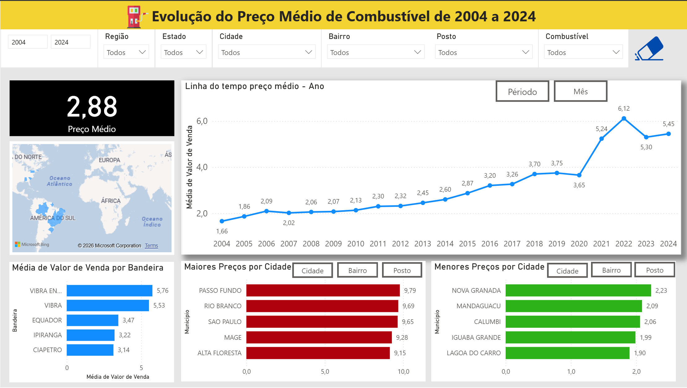
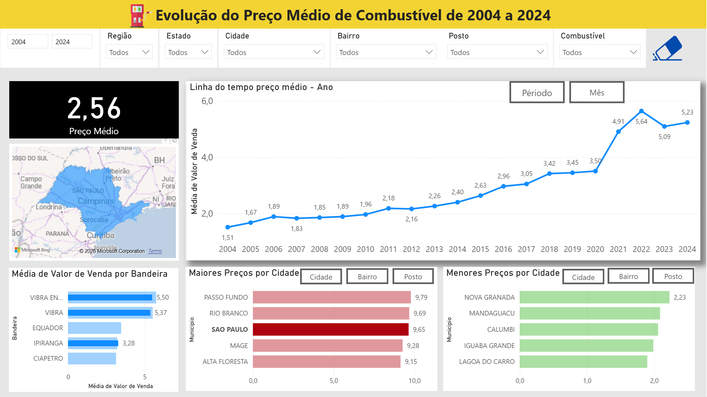

# ⛽ Evolução dos Preços de Combustíveis no Brasil

Dashboard em Power BI que analisa a evolução do preço médio de combustíveis no Brasil entre 2004 e 2024, com base em dados públicos de coleta de preços em postos de todo o país.

> 🟡 **Meu primeiro projeto em Power BI.** Este trabalho marca o início da minha trajetória com Business Intelligence e análise de dados, e é mantido aqui em sua forma original para acompanhar minha evolução técnica ao longo do tempo.

## 📌 Sobre o projeto

O projeto teve como objetivo construir um dashboard exploratório sobre a variação dos preços de combustíveis no Brasil ao longo de duas décadas, utilizando dados públicos disponibilizados pelo Governo Federal através do portal [dados.gov.br](https://dados.gov.br).

Foi desenvolvido como primeiro contato prático com Power BI, servindo para experimentar, de ponta a ponta, o fluxo de importação de dados, modelagem, criação de filtros e construção de um painel visual interativo.

## 🎯 Objetivo da análise

Com base nos dados e nos filtros disponíveis no dashboard, as perguntas que a análise busca responder são:

- Como o preço médio dos combustíveis evoluiu de 2004 a 2024?
- Quais estados, municípios e postos apresentaram os maiores e os menores preços registrados?
- Como o preço médio varia entre diferentes bandeiras (redes/distribuidoras)?
- Como filtros de região, estado, cidade, bairro, posto e tipo de combustível alteram o cenário de preços?

## 🗂️ Fonte dos dados

Os dados utilizados são públicos, disponibilizados pelo Governo Federal através do portal **dados.gov.br**. A estrutura das colunas identificadas no modelo (`Regiao - Sigla`, `Estado - Sigla`, `Municipio`, `Revenda`, `CNPJ da Revenda`, `Produto`, `Data da Coleta`, `Valor de Venda`, `Valor de Compra`, `Unidade de Medida`, `Bandeira`) é compatível com o formato do **Levantamento de Preços de Combustíveis da ANP** (Agência Nacional do Petróleo, Gás Natural e Biocombustíveis).

Os arquivos originais foram importados em formato CSV, separados por semestre (ex.: primeiro e segundo semestre de cada ano, de 2004 a 2024), e carregados no Power BI através do Power Query.

**Principais características da base, apuradas diretamente no modelo:**

| Métrica | Valor |
|---|---|
| Período coberto | 10/05/2004 a 28/06/2024 |
| Registros (linhas) | 23.595.518 |
| Regiões | 5 |
| Estados (UF) | 27 |
| Municípios | 699 |
| Postos distintos (por CNPJ) | 35.809 |
| Tipos de combustível | 8 (Gasolina, Gasolina Aditivada, Etanol, Diesel, Diesel S10, Diesel S50, GNV, e uma variação de digitação "Etano") |
| Preço médio geral do período | R$ 2,88 |

Esse volume de dados permite tanto uma análise temporal de longo prazo (20 anos) quanto recortes geográficos bastante granulares, até o nível de posto individual.

## 📊 Dashboard

🔗 [Acesse o dashboard publicado no Power BI](https://app.powerbi.com/view?r=eyJrIjoiYzZlZDAxNDctOTkxNi00OTQ4LWFjZWQtYTQ4Y2FmNDI0YWQzIiwidCI6IjMxMGJmZTRmLWUyMTQtNDUzZC04ZTM1LWM5YmYzYzM4MWQyMSJ9) — publicado em 07/08/2024





O dashboard tem como título **"Evolução do Preço Médio de Combustível de 2004 a 2024"** e é composto por:

- **Filtros**: período (slider de ano inicial/final), região, estado, cidade, bairro, posto e tipo de combustível, todos interconectados.
- **Card de preço médio**: exibe o preço médio de venda considerando o contexto de filtros aplicado.
- **Mapa**: destaca a região/estado selecionado nos filtros, servindo como referência geográfica da seleção atual.
- **Linha do tempo**: evolução do preço médio por ano, com opção de alternar a granularidade entre período e mês.
- **Média de valor de venda por bandeira**: ranking das bandeiras por preço médio praticado.
- **Maiores preços por localização**: ranking configurável entre cidade, bairro e posto.
- **Menores preços por localização**: ranking equivalente para os menores preços encontrados.

## 🔎 Principais análises

### Evolução histórica

O preço médio nacional saiu de **R$ 1,66 em 2004** para **R$ 6,12 em 2022** (pico da série), recuando para **R$ 5,30 em 2023** e fechando o período analisado em **R$ 5,45 em 2024**. A trajetória mostra um crescimento relativamente estável até 2020, seguido por uma alta acentuada em 2021-2022.

### Distribuição geográfica

O mapa e os filtros de região/estado/cidade/bairro permitem observar como o preço médio se comporta em diferentes localidades do país, com destaque para a possibilidade de isolar um único estado (como no exemplo de São Paulo) e visualizar sua série histórica isoladamente.

### Análise por bandeira

A base contém 269 valores distintos cadastrados no campo "Bandeira" (incluindo variações de grafia entre os anos). Em volume de registros, a bandeira **"BRANCA"** (postos sem bandeira/distribuidora vinculada) concentra a maior parte das coletas, seguida por **Raízen** e **CBPI**. Em termos de preço médio, o dashboard destaca Vibra Energia, Vibra, Equador, Ipiranga e Ciapetro entre as bandeiras com maiores médias de venda.

### Maiores preços

No agregado nacional, os maiores preços médios por cidade foram registrados em **Passo Fundo (R$ 9,79)**, **Rio Branco (R$ 9,69)**, **São Paulo (R$ 9,65)**, **Magé (R$ 9,28)** e **Alta Floresta (R$ 9,15)**.

### Menores preços

Os menores preços médios por cidade foram registrados em **Nova Granada (R$ 2,23)**, **Mandaguaçu (R$ 2,09)**, **Calumbi (R$ 2,06)**, **Iguaba Grande (R$ 1,99)** e **Lagoa do Carro (R$ 1,90)**.

### Segmentação dos dados

Os filtros de região, estado, cidade, bairro, posto e combustível permitem segmentar a análise em diferentes níveis, do panorama nacional até um único posto de combustível.

## 🧰 Tecnologias utilizadas

- **Power BI Desktop** — modelagem de dados e construção do relatório.
- **Power Query (linguagem M)** — importação e combinação dos arquivos CSV semestrais.
- **Arquivos CSV** — formato de origem dos dados públicos.

O modelo não utiliza medidas DAX customizadas — os cálculos de preço médio, contagens e agregações exibidos no dashboard são feitos com as agregações implícitas padrão do Power BI (soma/média sobre a coluna `Valor de Venda`).

## 🧠 Aprendizados

Este projeto foi meu primeiro exercício prático com Power BI e me permitiu praticar:

- Importação e combinação de múltiplos arquivos CSV via Power Query.
- Construção de um dashboard interativo do zero, incluindo layout, cores e organização visual.
- Criação de filtros (segmentações) cruzados por região, estado, cidade, bairro, posto e produto.
- Análise temporal de uma série histórica extensa (20 anos de dados).
- Análise geográfica com uso de visual de mapa.
- Exploração de uma base de dados pública de grande volume (mais de 23 milhões de registros).

## 📈 Evolução do projeto

Este projeto foi meu primeiro contato prático com o desenvolvimento de dashboards no Power BI. Por esse motivo, optei por mantê-lo no portfólio em sua essência original, permitindo visualizar a evolução das técnicas de modelagem, design, análise e desenvolvimento utilizadas nos meus projetos mais recentes.

## 🚀 Possíveis evoluções futuras

Com base na estrutura atual do modelo, algumas evoluções possíveis para este projeto incluem:

- Consolidar os dados semestrais em uma única tabela fato, hoje distribuídos em tabelas independentes por semestre.
- Revisar a modelagem para uma estrutura mais próxima de um modelo estrela, com dimensões separadas (data, localidade, bandeira, produto).
- Criar medidas DAX customizadas (ex.: variação percentual ano a ano, comparação entre combustíveis, médias móveis).
- Padronizar valores inconsistentes no campo "Bandeira" e no campo "Produto" (ex.: variações de grafia entre anos).
- Revisar a identidade visual e a experiência de navegação do dashboard.
- Melhorar tooltips e rótulos dos visuais.
- Avaliar a atualização da base histórica com dados mais recentes.

## 📁 Estrutura do projeto

```
precos-combustiveis-brasil/
├── precos-combustiveis-brasil.pbix   # Arquivo do Power BI (modelo de dados + relatório)
├── imagens/
│   ├── Posto1.png              # Print do dashboard - visão geral (Brasil)
│   └── Posto2.png              # Print do dashboard - filtro aplicado (estado de São Paulo)
└── README.md
```

Os arquivos CSV de origem não fazem parte deste repositório (devido ao volume de dados) e são referenciados localmente na consulta de importação do Power Query.

## 👤 Autor

**Gabriel Alcazar**

- LinkedIn: [linkedin.com/in/gabriel-alcazar-3329a91b4](https://www.linkedin.com/in/gabriel-alcazar-3329a91b4/)
- GitHub: [github.com/AlcazarGabriel](https://github.com/AlcazarGabriel)
